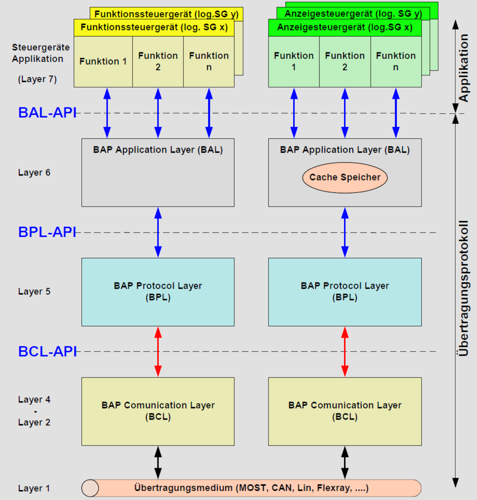

# Bedien- und Anzeigeprotokoll

Das Bedien- und Anzeige-Protokoll ist dafür ausgelegt Bedien- und Anzeigeinformationen
zwischen Steuergeräten auszutauschen. Das Protokoll ist nicht dafür ausgelegt sicherheitsrelevante
Informationen zu übertragen und zu überwachen.
[I: LAH-BAP284]
Hierzu wurden die verschiedenen Arten von Steuergeräten in Anzeige-, Bedien-, und Funktionssteuergeräte
aufgeteilt. Jedes dieser Steuergeräte hat bestimmte Aufgaben, Funktionalitäten
und Eigenschaften, die mit der BAP-Architektur festgeschrieben werden. Es gibt hierbei
aber nicht nur diese drei Grundformen der Steuergeräte, sondern auch Mischformen, in
denen ein Steuergerät gleichzeitig Anzeige- und Bediensteuergerät ist (z.B. Klimabedienteil
oder Navigation)

Ein Funktionssteuergerät trägt die Funktionalität und Eigenschaft eines speziellen Steuerge-rätes. Das Funktionssteuergerät hat kein HMI und keine displayabhängigen Parameter. Es bekommt über BAP die zur Erfüllung seiner Funktionalität notwendigen Parameter (Sollwer-te) und liefert über BAP die Ergebnisse und aktuellen Statusinformationen (Anzeigeinforma-tion) an alle Anzeigesteuergeräte. Der Begriff „logisch“ soll verdeutlichen, dass es sich um eine Funktionseinheit (von ggf. mehreren Funktionseinheiten) in einem physikalisch Steuer-gerät handelt, die für BAP und die Adressierung jeweils einzeln als „logisches Steuergerät“ angesprochen werden kann.

Ein Bediensteuergerät ist ein Steuergerät, das die Anpassung eines hardwaremäßigen Ein-gabeelementes (z.B. Taster, Schalter) an eine abstrahierte Schnittstelle zum Anzeigesteuer-gerät vornimmt. Im Allgemeinen muss hier zwischen Bedienelementen, die direkt einem Steuergerät zugeordnet sind, z.B. Taste am Klimabedienteil, und Bedienelementen, die für verschiedene Steuergeräte unterschiedliche Funktionen haben, unterschieden werden.

Ein Anzeigesteuergerät ist ein Steuergerät, das die Schnittstelle zum Bediener („User“) her-stellt. Das kann ein visuelles HMI, wie ein Display, aber auch ein akustisches HMI, wie ein Sprachbediensystem, bedeuten. Alle für das HMI notwendigen Informationen, wie z.B. Bil-der, GUI-Elemente, Töne, werden im Anzeigesteuergerät abgelegt. Das Anzeigesteuergerät bekommt seine Informationen von den Funktionssteuergeräten und gibt diese Informationen visuell und/oder akustisch aus.

Im Anzeigesteuergerät ist auch die Bedienlogik abgelegt. Die Bedienlogik (Ablaufsteuerung) entscheidet, was passiert, wenn zum Beispiel eine bestimmte Taste im Bediensteuergerät gedrückt wird und von welchem Steuergerät dann welche Informationen angefordert und dargestellt werden müssen.

Einsatzzweck des BAP ist die Trennung zwischen Bedien- und Anzeigelogik in den Anzeige-steuergeräten einerseits und in die Funktionslogik in den Funktionssteuergeräten anderer-seits. Damit soll weitestgehend vermieden werden, Bedien- und Anzeigelogik in den Funkti-onssteuergeräten zu implementieren. Dies soll die möglichst freie Einsetzbarkeit von FSG in den verschiedenen Fahrzeugen und Plattformen ermöglichen.

In Abbildung 3-1 ist das OSI Schichtenmodell angewendet auf den BAP Protocol Stack dar-gestellt. Der BAP Protocol Stack ist in drei Protokollschichten eingeteilt, die jeweils eine defi-nierte Aufgabe haben.

Der BAP Protocol Stack besteht aus dem:
∙BAP Application Layer (BAL),
∙BAP Protocol Layer (BPL),
∙BAP Communication Layer (BCL).

Die für BAL, BPL und BCL angegebenen öffentlichen Schnittstellen müssen wie angegeben implementiert werden. Die internen Schnittstellen des BAP-Stacks, also die Dienst-Primitive zwischen den einzel-nen Schichten, sind hier zur Information und Modellierung dargestellt. Wie sie konkret umzu-setzen sind, wird in diesem Dokument nicht festgelegt. Die im Folgenden festgelegten Funktionalitäten, Verhaltensweisen und Protokolldaten der jeweiligen Schichten des BAP-Stacks sind verbindlich.

Im Layer 6 befindet sich der BAP Application Layer (BAL), der die funktionsspezifische Anpassung
an die jeweilige Applikation herstellt. Die Schnittstelle der jeweiligen Funktion des
Funktions-, oder Anzeigesteuergerätes ist die BAL-API. Der BAP Application Layer ist zuständig für alle Aufgaben zur Aufbereitung, Datenhaltung
und Gültigkeit der Applikationsdaten.
BAP Protocol Layer (BPL) 

Der BAP Application Layer ist zuständig für alle Aufgaben zur Aufbereitung, Datenhaltung
und Gültigkeit der Applikationsdaten.
BAP Protocol Layer (BPL)5 und 4 gibt es das BAP Communcation Layer Interface (kurz BCL-API), das für alle Über-tragungsmedien der Schnittstelle gleich ist.
BAP Communication Layer (BCL)In den Layers 2-4 ist der BAP Communication Layer (BCL) dargestellt, der die Anpassung an das jeweilige Übertragungsmedium und die jeweiligen Übertragungsprotokolle herstellt. Der BCL arbeitet auf den Treibern der jeweiligen Übertragungsschicht.