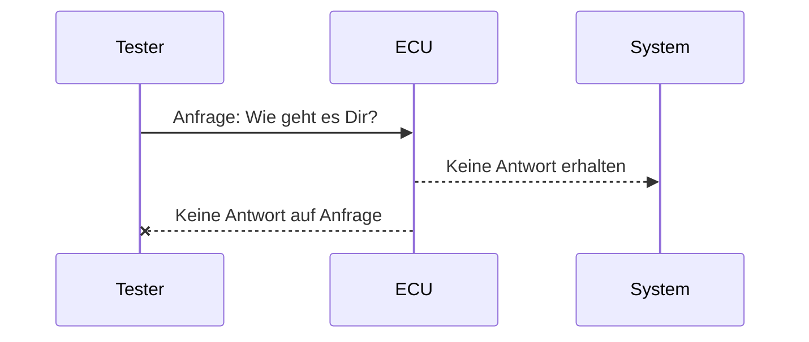

# Grundlagen der Kommunikation

## Arten der Kommunikation in der Fahrzeugdiagnose

In der Fahrzeugdiagnose spielen verschiedene Arten der Kommunikation eine entscheidende Rolle, um Informationen zwischen verschiedenen Akteuren auszutauschen und zu verstehen. Diese Kommunikationsarten umfassen visuelle, auditive, taktile und datenbasierte Austauschformen zwischen Menschen, Maschinen und Maschinen untereinander.

## Visuelle Kommunikation

Visuelle Kommunikation bezieht sich auf die Übermittlung von Informationen durch visuelle Reize wie Grafiken, Diagramme oder Anzeigen auf Diagnosegeräten. Dies ermöglicht eine effektive Darstellung von Diagnosedaten und Fehlercodes.

## Auditive und Taktile Kommunikation

Auditive Kommunikation bezieht sich auf die Übertragung von Informationen über Geräusche oder Töne, die beispielsweise bei der Diagnose von Fahrzeuggeräuschen relevant sein können. Taktile Kommunikation beinhaltet den Informationsaustausch über Berührungen oder Vibrationen, die bei der Prüfung von Bauteilen oder Sensoren eingesetzt werden können.

## Datenbasierte Kommunikation

Die datenbasierte Kommunikation in der Fahrzeugdiagnose umfasst den Austausch von Informationen in Form von Sprache, Programmiersprachen und Protokollen. Beispiele hierfür sind die Verwendung von Englisch als Standardsprache, C++ als Programmiersprache für Diagnosesoftware, Maschinencode für die Steuergerätekommunikation sowie Protokolle wie ISO 15765-3 für die präzise Datenübertragung.

## Mensch-Mensch, Mensch-Maschine, Maschine-Maschine

Die Kommunikation in der Fahrzeugdiagnose erstreckt sich über verschiedene Ebenen, darunter die Interaktion zwischen Menschen und Menschen (z.B. Werkstattmitarbeiter und Kunden), zwischen Menschen und Maschinen (z.B. Bedienung von Diagnosegeräten) sowie zwischen Maschinen untereinander (z.B. Steuergeräte im Fahrzeug).

Insgesamt ist die Vielfalt der Kommunikationsarten in der Fahrzeugdiagnose entscheidend für einen effizienten Informationsaustausch und eine präzise Fehleranalyse, um eine schnelle und genaue Diagnose von Fahrzeugproblemen zu gewährleisten.

## Kommunikation mit einem Steuergerät

- **Anfrage:** Wie geht es Dir?
- **Herausforderung:** Nie bekomme ich eine Antwort auf meine Fragen!
- **Lösung:** Kommunikationssystem und Übersetzungssystem
- **Information:** 58 00
- **Kommunikationsthema:** Wie geht es Dir

Diese Kommunikationssequenzen mit einem Steuergerät verdeutlichen die Interaktionen und Herausforderungen bei der Kommunikation in der Fahrzeugdiagnose. Die Lösung durch ein effizientes Kommunikations- und Übersetzungssystem zeigt den Weg zur erfolgreichen Informationsübermittlung und -verarbeitung.

## Steuergerätevernetzung im Fahrzeug

Die Steuergeräte eines Fahrzeugs sind miteinander verbunden, um eine reibungslose Kommunikation und Koordination verschiedener Funktionen zu ermöglichen. Diese Vernetzung ermöglicht den Datenaustausch zwischen den Steuergeräten, um das Fahrzeug effizient zu steuern und zu überwachen.

### On-Board-Kommunikation - Normal Communication

Die On-Board-Kommunikation bezieht sich auf die Kommunikation zwischen den Steuergeräten im Fahrzeug. Durch Normal Communication tauschen die Steuergeräte Daten aus, um Betriebsfunktionen wie Motorsteuerung, Bremsen, Beleuchtung und mehr zu koordinieren.

### Offboard-Kommunikation - Diagnosekommunikation

Die Offboard-Kommunikation beinhaltet die Kommunikation zwischen einem Diagnosegerät und den Steuergeräten im Fahrzeug. Dies ermöglicht die Diagnose von Fehlern, das Auslesen von Daten und die Durchführung von Wartungsarbeiten.

### Diagnosestecker (OBD-Stecker) und Gateway

Der Diagnosestecker (OBD-Stecker) dient als Schnittstelle für die Offboard-Diagnosekommunikation. Das Gateway fungiert als Vermittler zwischen dem Diagnosegerät und den verschiedenen Steuergeräten im Fahrzeug.

### Direkter Buszugang

Der direkte Buszugang ermöglicht es, gezielt auf bestimmte Busse im Fahrzeug zuzugreifen, um spezifische Diagnosedaten abzurufen oder Einstellungen vorzunehmen.

## Diagnosebegriffe

- **On-Board / Off-Board:** Unterscheidung zwischen der Kommunikation innerhalb des Fahrzeugs (On-Board) und der externen Kommunikation mit Diagnosegeräten (Off-Board).
- **On-Board Communication:** Kommunikation zwischen den Steuergeräten im Fahrzeug.
- **Off-Board Communication:** Kommunikation zwischen einem Diagnosetester und den Steuergeräten im Fahrzeug.
- **On-Board Diagnostics:** Überwachung von Funktionen und Systemen innerhalb des Fahrzeugs.
- **Off-Board Diagnostics:** Aufgaben eines Technikers bei der externen Diagnose und Wartung des Fahrzeugs.

## Steuergerätefunktionen

Die Funktionen der Steuergeräte umfassen:

- Regler für verschiedene Systeme im Fahrzeug.
- Ein-/Ausgänge für analoge, digitale Signale usw.
- On-Board-Kommunikation: Normal Communication für den Austausch von Prozessdaten über Broadcast (CAN-Bus).
- Offboard-Kommunikation: Diagnosekommunikation mit spezifischen Protokollen wie Master/Slave oder ereignisgesteuerten Übertragungen.

Insgesamt bilden die vernetzten Steuergeräte, ihre Kommunikationsarten und Funktionen ein komplexes System, das eine effiziente Fahrzeugdiagnose und -wartung ermöglicht.

## Das ISO/OSI Schichtenmodell der Kommunikation

Das ISO / OSI – Schichtenmodell spielt eine entscheidende Rolle in der Diagnosekommunikation von Fahrzeugen. Es bietet eine strukturierte Herangehensweise an die Kommunikationssysteme, um eine effiziente Datenübertragung und -verarbeitung zu gewährleisten. Das ISO / OSI – Schichtenmodell definiert sieben Schichten, die die Kommunikation in einem Netzwerk regeln. Jede Schicht hat spezifische Aufgaben und Verantwortlichkeiten, die zur Gesamtfunktionalität des Kommunikationssystems beitragen. Die OSI-Modell-Schichten beschreiben die Funktionalität von Netzwerkprotokollen in sieben Schichten. Jede Schicht hat spezifische Aufgaben und Eigenschaften:

- **Schicht 1 - Physical Layer**: Diese fundamentale Schicht des OSI-Modells ist für die physische Übertragung von Daten verantwortlich. Sie stellt die ungesicherte Verbindung für die Übertragung von Bits bereit, kontrolliert den Zugriff auf das Übertragungsmedium und führt grundlegende Signalverarbeitung wie Modulation und Demodulation durch.

- **Schicht 2 - Data Link Layer**: Der Data Link Layer regelt die Datenübertragung zwischen direkt benachbarten Netzwerkknoten. Hier wird der Zugriff auf das Medium koordiniert, Fehlerkorrekturmechanismen implementiert, Prüfsummen zur Integritätsprüfung genutzt und Daten in Frames strukturiert übertragen.

- **Schicht 3 - Network Layer**: Im Network Layer werden Routen festgelegt und der Datenverkehr zwischen verschiedenen Netzwerken oder Segmenten geleitet. Diese Schicht kümmert sich um die Wegfindung, das Routing und das Weiterleiten von Datenpaketen an die nächstgelegenen Knoten.

- **Schicht 4 - Transport Layer**: Der Transport Layer gewährleistet eine zuverlässige und effiziente Datenübertragung zwischen Endgeräten. Hier erfolgt die Segmentierung von Daten, die Steuerung des Datenflusses, die Gewährleistung von Quality of Service (QoS) und die Anpassung an unterschiedliche Leistungsbandbreiten.

- **Schicht 5 - Session Layer**: Der Session Layer etabliert, verwaltet und beendet Kommunikationssitzungen zwischen Anwendungen. Er ermöglicht die Wiederherstellung von Verbindungen nach Unterbrechungen, koordiniert den Datenaustausch und unterstützt große Datenmengen sowie komplexe Transaktionen.

- **Schicht 6 - Presentation Layer**: Im Presentation Layer erfolgt die Darstellung und Umwandlung von Daten in für den Austausch geeignete Formate. Hier werden systemabhängige Darstellungsarten konvertiert, Kompression und Verschlüsselung durchgeführt sowie die Interoperabilität zwischen verschiedenen Systemen sichergestellt.

- **Schicht 7 - Application Layer**: Die Application Layer ist die Schnittstelle für Anwendungen zur Kommunikation über ein Netzwerk. Hier werden spezifische Dienste und Protokolle bereitgestellt, um Anwendungen miteinander zu verbinden und den Austausch von Informationen zu ermöglichen.

## Eigenschaften des Physical Layers

- Bietet grundlegende Bitübertragungsfunktionen.
- Verantwortlich für die physische Übertragung von Daten.
- Ermöglicht den Zugriff auf das Übertragungsmedium und führt Modulation/Demodulation durch.
- Wird bei der Diagnosekommunikation für spezifische Protokolle wie CAN eingesetzt.

Insgesamt bildet das ISO / OSI – Schichtenmodell eine strukturierte Grundlage für die Entwicklung und Implementierung von Kommunikationssystemen in der Fahrzeugdiagnose. Durch die klare Aufteilung der Aufgaben auf verschiedene Schichten wird eine effiziente und zuverlässige Datenübertragung gewährleistet.

## ISO/OSI in der Fahrzeugdiagnose

Die Grundlagen der Datenkommunikation im Automobilbereich umfassen die Unterscheidung zwischen Onboard-Kommunikation (Normal Communication) und Offboard-Kommunikation (Diagnosekommunikation), die über OBD-Stecker oder direkte Buszugänge erfolgen kann. Das ISO/OSI-Modell dient zur Strukturierung der Aufgaben eines Kommunikationssystems, wobei die Protocol Data Unit (PDU) einer OSI-Schicht sowohl die Service Data Unit (Nutzdaten des Dienstes) als auch die Protocol Control Information (Header/Trailer) enthält. Im Automobilsektor wird das ISO/OSI-Modell als Grundlage für die Beschreibung der Diagnosekommunikation genutzt und in entsprechenden ISO-Normen festgehalten. Die Hauptschichten im Automobilbereich sind der Application Layer, Transport Layer, Data Link Layer und Physical Layer.