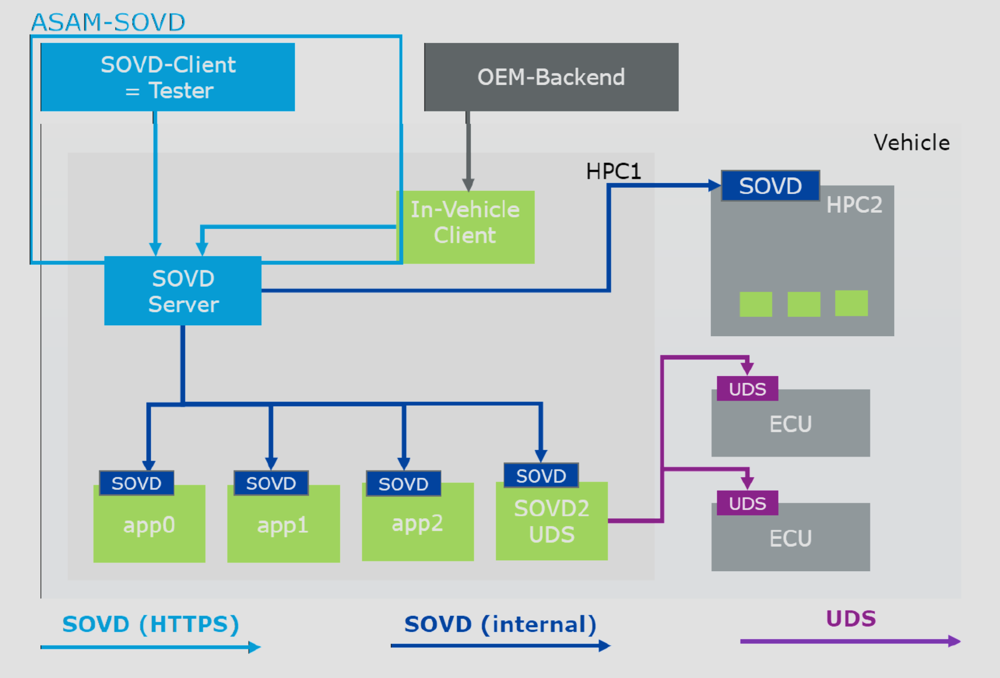
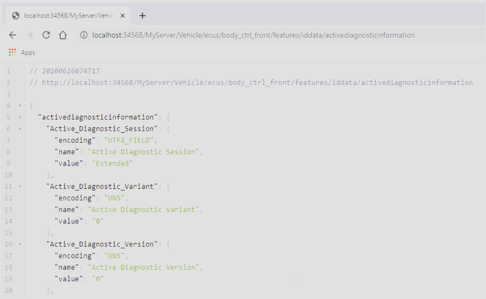
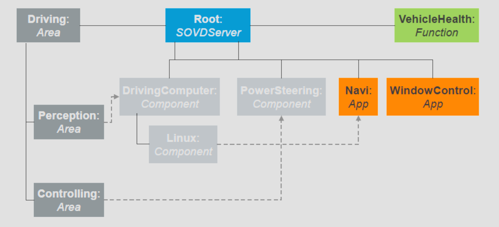
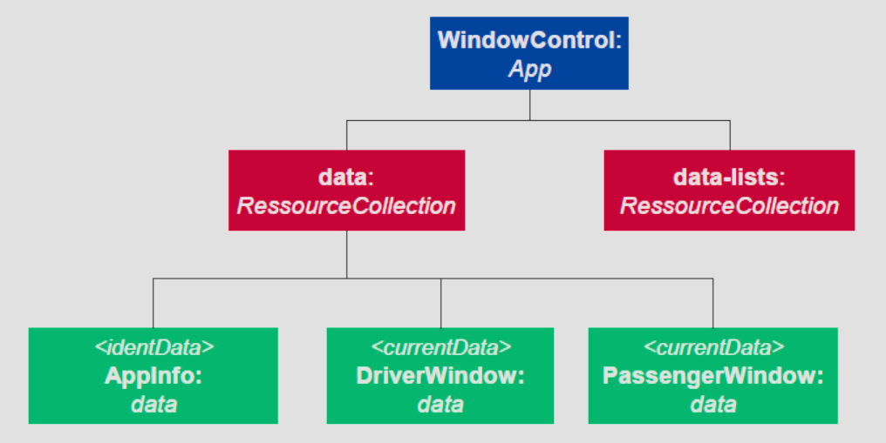
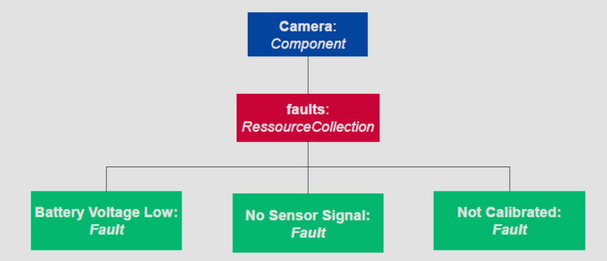
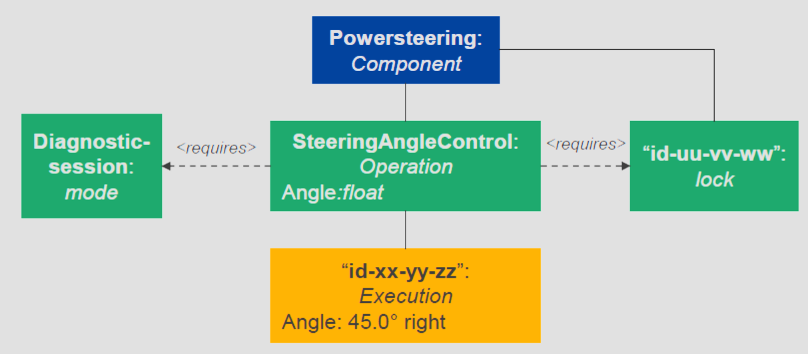
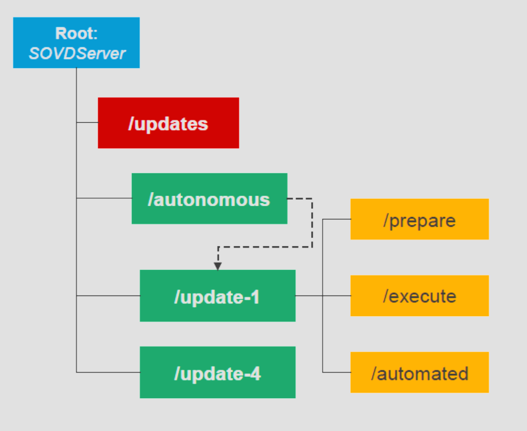
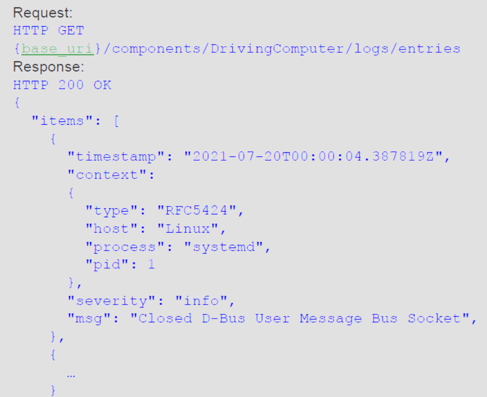

# Service Oriented Vehicle Diagnostics

Service Oriented Vehicle Diagnostics (SOVD) stellt eine wegweisende Herangehensweise an die Fahrzeugdiagnose dar, die auf serviceorientierten Prinzipien basiert. Die Entwicklung und Implementierung von SOVD werden durch verschiedene Faktoren angetrieben, wobei die Notwendigkeit, sich den Herausforderungen moderner Fahrzeugtechnologien zu stellen, im Mittelpunkt steht.

Die fortlaufende Evolution von Fahrzeugarchitekturen, die Integration von High-Performance-Computing (HPC) und die steigende Komplexität von Softwareanwendungen in Fahrzeugen erfordern innovative Ansätze in der Fahrzeugdiagnose. SOVD wird angetrieben von der Motivation, eine effiziente, skalierbare und serviceorientierte Diagnoseplattform zu schaffen, die den sich wandelnden Anforderungen der Automobilindustrie gerecht wird.

Die Herausforderungen, denen SOVD begegnet, sind vielfältig. Sie reichen von der Diagnose von Hardwarefehlern über die Analyse von Softwareproblemen bis hin zur dynamischen Anpassung an sich verändernde Diagnoseanforderungen im Fahrzeug. Die Notwendigkeit, den Fokus von traditionellen Ansätzen wie dem Unified Diagnostic Service (UDS) zu erweitern, erfordert neue Architekturen und Ansätze.

Die Ziele von SOVD sind klar definiert. Eine einheitliche API für Diagnose und Softwareaktualisierung über verschiedene Fahrzeugtypen hinweg steht im Vordergrund. SOVD strebt einen konsistenten Ansatz an, der sowohl für traditionelle Sensor- und Aktuatorsysteme als auch für moderne HPC-basierte Architekturen geeignet ist. Dabei werden verschiedene Anwendungsszenarien wie Proximal, In-Vehicle und Remote unterstützt.

SOVD bietet eine umfassende Übersicht über verschiedene Konzepte und Technologien. Die Integration von HTTP/REST-Prinzipien bildet die Grundlage für eine effiziente Kommunikation und Interaktion zwischen Fahrzeug und Diagnosesystem. Dabei werden verschiedene Methoden definiert, die von der Fähigkeitserkennung über den Zugriff auf Datenressourcen bis hin zur Softwareaktualisierung und Fehlerbehandlung reichen.

Die grundlegenden Konzepte von SOVD erstrecken sich über die Entdeckung von Entitäten, den Zugriff auf Daten und die Steuerung von Operationen bis hin zu Fähigkeitserkennung, Logging und Softwareaktualisierung. Diese Konzepte bilden das Rückgrat von SOVD und ermöglichen eine flexible, skalierbare und serviceorientierte Fahrzeugdiagnose.

SOVD nutzt die Prinzipien von HTTP/REST für eine effiziente, standardisierte Kommunikation. Diese Technologie ermöglicht einen einfachen Zugriff auf Diagnose- und Aktualisierungsdienste über das World Wide Web, wobei RESTful-Services eine klare Struktur und Interaktion bieten.

Die verschiedenen Methoden in SOVD decken ein breites Spektrum von Funktionen ab. Von der Fähigkeitserkennung über den Zugriff auf Datenressourcen zum Lesen/Schreiben bis hin zu spezifischen Methoden für die Fehlerbehandlung, Steuerung von Operationen, Softwareaktualisierung und Logging bietet SOVD umfassende Werkzeuge für eine effektive Fahrzeugdiagnose.

In dieser Übersicht wird deutlich, dass SOVD nicht nur als Reaktion auf aktuelle Herausforderungen in der Automobilindustrie entstanden ist, sondern auch als visionärer Ansatz für eine zukunftsweisende und serviceorientierte Fahrzeugdiagnose.

## Motivation

### Herausforderungen

Die voranschreitende Entwicklung von High-Performance-Computing (HPC) hat eine grundlegende Veränderung in der Architektur von Systemen eingeleitet. Mit der Einführung von mehreren Betriebssystemen (OS) und einer Vielzahl von Anwendungen mit unterschiedlichen Abhängigkeiten entstehen neue Herausforderungen im Bereich der Diagnose. Diese Herausforderungen erstrecken sich nicht nur auf die Identifizierung von Hardwarefehlern, sondern beinhalten auch die Analyse von Softwareproblemen. Die fortschreitende Integration von HPC-Architekturen in Fahrzeugsysteme erfordert eine innovative Herangehensweise an Diagnoseverfahren.

Herausforderungen:

1. **Vielfalt der Architekturen:** Die Einführung von HPCs in Fahrzeugsystemen bringt eine Vielzahl von Architekturen mit sich. Diese Vielfalt erschwert nicht nur die Diagnose von Hardwarefehlern, sondern stellt auch eine Herausforderung für die Identifizierung und Behebung von Softwareproblemen dar.
2. **Mehrere Betriebssysteme (OS):** Die Integration von mehreren Betriebssystemen in einem Fahrzeug führt zu komplexen Interaktionen und potenziellen Konflikten. Die Diagnose von Fehlern, sei es auf Hardware- oder Softwareebene, erfordert ein tiefes Verständnis der Wechselwirkungen zwischen diesen Betriebssystemen.
3. **Vielfältige Anwendungen und Abhängigkeiten:** Die steigende Anzahl und Vielfalt von Anwendungen, die auf HPCs in Fahrzeugen laufen, erhöhen die Komplexität der Diagnose. Die unterschiedlichen Abhängigkeiten zwischen diesen Anwendungen machen es schwierig, Ursachen von Fehlern zu ermitteln und geeignete Lösungen zu finden.
4. **Veränderung der Softwareanalyse:** Im Zuge der fortschreitenden Integration von HPCs verschiebt sich der Fokus von der reinen Hardwareanalyse hin zur Analyse von Softwareproblemen. Dies erfordert neue Arten von Daten, wie zum Beispiel Logs, Traces, Prozessinformationen und Stack Traces, um effektive Diagnosen durchzuführen.
5. **Dynamischer Wandel der Diagnoseinhalte:** Im Gegensatz zur statischen Herangehensweise des Unified Diagnostic Services (UDS) ändern sich die Diagnoseinhalte in Fahrzeugen dynamisch. Dies bedeutet, dass die Diagnosesysteme flexibel genug sein müssen, um sich an die sich ändernden Anforderungen anzupassen und weiterhin genaue Diagnosen durchzuführen.
6. **Komplexe Software-Updates:** Die Art der Softwareaktualisierung wird sich grundlegend ändern. Statt einzelner Bits und Bytes zu übertragen, müssen Diagnosesysteme nun komplexe Updateverfahren im Fahrzeug steuern. Dies erfordert ein hohes Maß an Präzision und Kontrolle, um sicherzustellen, dass Updates reibungslos durchgeführt werden und keine neuen Probleme verursachen.

Insgesamt stellen die neuen Architekturen auf Basis von HPCs, die Integration mehrerer Betriebssysteme und die dynamischen Anforderungen der Softwareanalyse eine erhebliche Herausforderung für die Fahrzeugdiagnose dar. Die Entwicklung innovativer Diagnosesysteme, die diesen Herausforderungen gerecht werden, ist von entscheidender Bedeutung, um die Zuverlässigkeit und Leistungsfähigkeit moderner Fahrzeuge sicherzustellen.

### Ziele

Die fortlaufende Evolution von Fahrzeugtechnologien und die Integration von High-Performance-Computing (HPC) erfordern eine grundlegende Überarbeitung der Diagnose- und Softwareaktualisierungssysteme in der Automobilindustrie. Um den Anforderungen dieser sich wandelnden Landschaft gerecht zu werden, ist eine klare Motivation für die Entwicklung neuer Ansätze in der Fahrzeugdiagnose notwendig.

Ziele:

1. **Einheitliche API für Diagnose und Softwareaktualisierung (fahrzeugübergreifend):** Das Hauptziel besteht darin, eine einzige API (Application Programming Interface) zu schaffen, die sowohl für die Diagnose als auch für Softwareaktualisierungen in verschiedenen Fahrzeugen verwendet werden kann. Diese einheitliche Schnittstelle soll eine nahtlose Integration und Interaktion ermöglichen.
2. **Konsistenter Ansatz für neue und traditionelle Systeme:** Die entwickelte API sollte nicht nur für neuartige Systeme, die auf HPCs basieren, geeignet sein, sondern auch für traditionelle Sensor- und Aktuatorsysteme anwendbar sein. Ein konsistenter Ansatz gewährleistet eine einheitliche Handhabung unabhängig von der zugrunde liegenden Technologie.
3. **Anwendungsszenarien:**

   - **Proximal:** Die Diagnose- und Updatefunktionen sollten nahtlos in unmittelbarer Nähe des Fahrzeugs erfolgen können, um Echtzeitinformationen zu sammeln und schnelle Reaktionen zu ermöglichen.
   - **In-Fahrzeug:** Die API sollte effiziente Diagnose- und Softwareaktualisierungsmöglichkeiten direkt im Fahrzeug bieten, um die Wartung und Aktualisierung der Systeme zu erleichtern.
   - **Remote:** Es sollte auch die Möglichkeit geben, Diagnosen und Softwareaktualisierungen aus der Ferne durchzuführen, um flexibel auf Probleme zu reagieren, ohne dass das Fahrzeug physisch präsent sein muss.
4. **Selbstbeschreibende API:** Im Gegensatz zu heutigen Ansätzen, die externe Beschreibungsdateien erfordern, sollte die entwickelte API selbstbeschreibend sein. Dies bedeutet, dass sie alle erforderlichen Informationen zur Diagnose und Softwareaktualisierung enthält, ohne auf externe Ressourcen angewiesen zu sein.
5. **Auswahl und Kombination geeigneter Technologien:** Zur Umsetzung der Ziele sollten bereits existierende und bewährte Technologien ausgewählt und effektiv miteinander kombiniert werden. Dies gewährleistet nicht nur eine höhere Effizienz, sondern erleichtert auch die Integration in bestehende Fahrzeugsysteme.

Die Verwirklichung dieser Ziele wird nicht nur die Effektivität der Fahrzeugdiagnose und -aktualisierung verbessern, sondern auch zu einer höheren Flexibilität und Kompatibilität zwischen verschiedenen Fahrzeugtypen und Technologien führen.

### Übersicht

Die vorliegende Motivation zielt darauf ab, die Entwicklung und Implementierung einer innovativen Schnittstelle voranzutreiben, die als ASAM SOVD (Service Oriented Vehicle Diagnostics) bekannt ist. Diese Schnittstelle wurde insbesondere entwickelt, um traditionelle Anwendungsfälle sowie die speziellen Anforderungen im Zusammenhang mit High-Performance-Computing (HPC) in der Fahrzeugdiagnose abzudecken.

1. **Abdeckung traditioneller Anwendungsfälle durch SOVD:**

   - **Datenzugriff:** Die Schnittstelle ermöglicht den Zugriff auf Fahrzeugdaten, was essentiell für eine effektive Diagnose ist.
   - **Fehlerinformationen:** SOVD ermöglicht die Abfrage von Fehlinformationen, um schnell auf Probleme im Fahrzeug reagieren zu können.
   - **Steuerung interner Softwarefunktionen:** Die Schnittstelle bietet die Möglichkeit, interne Softwarefunktionen im Fahrzeug zu kontrollieren.
2. **Abdeckung von HPC-bezogenen diagnostischen Anwendungsfällen durch SOVD:**

   - **Fahrzeugsoftware-Update:** SOVD ermöglicht die Durchführung von Softwareaktualisierungen im Fahrzeug, wobei der Fokus auf HPC-bezogenen Anwendungen liegt.
   - **Protokollierung (Logging) und Nachverfolgung (Tracing):** Die Schnittstelle ermöglicht das Protokollieren und Nachverfolgen von Prozessen, um eine detaillierte Analyse von Abläufen im Fahrzeug zu ermöglichen.
   - **Zugriff auf Systeminformationen:** SOVD ermöglicht den Zugriff auf umfassende Systeminformationen, um eine umfassende Diagnose durchzuführen.
   - **Dynamische Entdeckung von Inhalten:** Die Schnittstelle ermöglicht die dynamische Entdeckung von Inhalten im Fahrzeug, was wichtig ist, um sich an sich ändernde Diagnoseanforderungen anzupassen.
3. **Basierend auf IT-Technologie (HTTP/REST, JSON, OAuth):**

   - Die Implementierung von SOVD basiert auf etablierten IT-Technologien wie HTTP/REST für die Kommunikation, JSON für den Datenaustausch und OAuth für die sichere Authentifizierung. Dies gewährleistet eine effiziente und sichere Datenübertragung zwischen Fahrzeug und Diagnosesystem.
4. **SOVD als Kapselung von UDS, ohne es zu ersetzen:**

   - SOVD fungiert als eine umfassende Schnittstelle, die Unified Diagnostic Services (UDS) umfasst, jedoch nicht ersetzt. Dies bedeutet, dass existierende UDS-Implementierungen weiterhin genutzt werden können, während gleichzeitig die Vorteile von SOVD genutzt werden.
5. **Fokus von ASAM SOVD auf der API:**

   - Der Hauptfokus von ASAM SOVD liegt auf der Definition einer einheitlichen API für Fahrzeugdiagnose und Softwareaktualisierung. Diskussionen über die praktische Umsetzung haben bereits im Rahmen des AUTOSAR (Automotive Open System Architecture) begonnen.

Zusammenfassend stellt ASAM SOVD eine zukunftsweisende Lösung dar, die traditionelle und HPC-bezogene Anwendungsfälle in der Fahrzeugdiagnose abdeckt. Durch die Nutzung etablierter IT-Technologien und die Integration mit bestehenden Standards wie UDS strebt SOVD an, die Effizienz und Flexibilität der Fahrzeugdiagnose erheblich zu verbessern.

## Konzepte

### HTTP/REST in a Nutshell

**REST (Representational State Transfer) in einem Überblick:**

1. **Basis auf HTTP:**

   - REST basiert grundlegend auf dem HTTP-Protokoll. Es ermöglicht die Interaktion über das World Wide Web und ist so konzipiert, dass bereits ein einfacher Webbrowser ausreicht, um RESTful-Services auszuführen.
2. **Ressourcen als zentrales Element:**

   - Das Kernkonzept von REST sind Ressourcen. Diese repräsentieren Entitäten oder Dienste und sind über eindeutige URLs erreichbar. Ressourcen können sowohl Daten als auch Funktionen repräsentieren.
3. **HTTP-Verben auf Ressourcen:**

   - Operationen auf Ressourcen werden durch die Verwendung von HTTP-Verben dargestellt. Beispielsweise steht GET für das Abrufen von Informationen, POST für das Erstellen neuer Ressourcen, PUT für das Aktualisieren und DELETE für das Löschen.
4. **Kenntnis der initialen URL genügt:**

   - Ein grundlegendes Verständnis der initialen URL reicht aus, um mit einem RESTful-Service zu interagieren. Weitere Links werden bereitgestellt, um die API zu entdecken und zusätzliche Informationen zu erhalten.
5. **Zustandslosigkeit von REST:**

   - REST ist zustandslos, was bedeutet, dass jeder Request alle relevanten Informationen enthält, die der Server benötigt, um ihn zu verarbeiten. Es gibt keine serverseitige Speicherung von Zustandsinformationen über mehrere Anfragen hinweg.
6. **Kein fahrzeugspezifischer Stack auf der Client-Seite erforderlich:**

   - Ein besonderes Merkmal von REST ist, dass auf der Client-Seite kein fahrzeugspezifischer Software-Stack erforderlich ist. Ein einfacher Webbrowser oder ein HTTP-Client reichen aus, um mit einem RESTful-Service zu kommunizieren.

**HTTP/REST in a Nutshell:**

In kurzer Zusammenfassung bietet HTTP/REST eine einfache und skalierbare Methode für die Kommunikation zwischen verschiedenen Systemen. Die Nutzung von HTTP-Verben auf Ressourcen ermöglicht eine klare und standardisierte Interaktion. Die Zustandslosigkeit von REST vereinfacht die Implementierung und Skalierbarkeit, während die Nutzung von standardisierten Webtechnologien wie HTTP, JSON und OAuth die Interoperabilität fördert. Das Fehlen eines fahrzeugspezifischen Stacks auf der Client-Seite erleichtert die Integration und Nutzung von REST in verschiedenen Umgebungen.

## Methoden

### Methode zur Fähigkeitserkennung

Entdeckung von Entitäten und Ressourcen:

**Entdeckung von enthaltenen Entitäten:**

- Ein wesentlicher Aspekt von REST ist die Möglichkeit zur Entdeckung von enthaltenen Entitäten. Dies ermöglicht es, Ressourcen in einem System aufzufinden und deren Struktur zu verstehen.

**Abfrage von Unterentitäten einer Entität:**

- REST bietet die Möglichkeit, Unterentitäten einer Hauptentität abzufragen. Dies ermöglicht eine detaillierte Untersuchung von Ressourcen und ihrer Hierarchie.

**Abfrage von verwandten Entitäten einer Entität:**

- Durch die Abfrage von verwandten Entitäten einer Hauptentität können Beziehungen und Verbindungen zwischen verschiedenen Ressourcen aufgedeckt werden.

**Abfrage von Fähigkeiten einer Entität:**

- Die Fähigkeiten einer Entität können durch geeignete Anfragen abgefragt werden. Dies ermöglicht die Bestimmung der unterstützten Operationen und Funktionen.

**Bereiche repräsentieren eine topologische Ansicht der Entitäten:**

- Zur besseren Organisation und Strukturierung bietet REST die Möglichkeit, Bereiche zu definieren, die eine topologische Sicht auf die vorhandenen Entitäten repräsentieren.

**Zugriff auf die Beschreibung von Fähigkeiten:**

- REST ermöglicht den Zugriff auf die Beschreibung von Fähigkeiten, einschließlich der Möglichkeit, eine Online-Beschreibung von Fähigkeiten abzurufen. Dies erleichtert die dynamische Anpassung an sich ändernde Systemanforderungen.

**Abfrage einer Online-Fähigkeitsbeschreibung:**

- Durch die Abfrage einer Online-Fähigkeitsbeschreibung können aktuelle Informationen zu den Fähigkeiten einer Entität erhalten werden.

**Abfrage von Schema-Informationen für die Verarbeitung von Inhalten:**

- REST ermöglicht die Abfrage von Schema-Informationen, um die Verarbeitung von Inhalten zu unterstützen. Dies ist besonders relevant für die korrekte Interpretation und Verarbeitung von Daten.

**Methode zur Fähigkeitsentdeckung:**

- REST definiert eine Methode zur Fähigkeitsentdeckung, die es ermöglicht, die verfügbaren Funktionen und Operationen eines Systems zu erkunden. Diese Methode bietet Transparenz über die Möglichkeiten, die von einer bestimmten Entität oder Ressource bereitgestellt werden.

**Identisches Format für Offline- und Online-Fähigkeitsbeschreibung:**

- Ein wichtiges Merkmal ist die Verwendung eines identischen Formats für die Offline- und Online-Beschreibung von Fähigkeiten. Hierbei wird auf etablierte Standards wie OpenAPI und JSON Schema zurückgegriffen, um eine konsistente und interoperable Beschreibung zu gewährleisten.

Die Möglichkeiten zur Entdeckung von Entitäten und Ressourcen in REST bieten eine flexible und skalierbare Grundlage für die Interaktion mit Systemen. Die einheitliche Struktur von Fähigkeitsbeschreibungen und deren Abfragemethoden ermöglichen eine effiziente Integration und Nutzung von RESTful-Services in verschiedenen Anwendungsbereichen.

### Methode für den Zugriff auf Datenressourcen zum Lesen/Schreiben

Methoden:

1. **Abrufen der Liste verfügbarer Daten für eine Entität:**

   - Eine grundlegende Methode in REST ist das Abrufen der Liste verfügbarer Daten für eine bestimmte Entität. Dies ermöglicht den Zugriff auf eine Vielzahl von Informationen, die von der Entität bereitgestellt werden.
2. **Kategorisierung von Daten nach Semantik:**

   - REST bietet die Möglichkeit, Daten gemäß ihrer Semantik zu kategorisieren. Beispiele für Datenkategorien können sein: `currentData` für aktuelle Daten, `identData` für Identifikationsdaten, `storedData` für gespeicherte Daten und `sysInfo` für Systeminformationen.
3. **Lese-/Schreibzugriff auf Daten:**

   - Eine wichtige Funktion von REST ist die Möglichkeit, Lese- und Schreibzugriff auf Daten zu gewähren. Dies ermöglicht nicht nur das Abrufen von Informationen, sondern auch das Aktualisieren oder Hinzufügen neuer Daten.
4. **Möglichkeiten zur Gruppierung von Daten:**

   - REST bietet verschiedene Möglichkeiten zur Gruppierung von Daten. Dies ermöglicht eine logische Organisation und Strukturierung der Informationen, um die Übersichtlichkeit und den Zugriff zu verbessern.
5. **Möglichkeiten zur Erstellung von aggregierten Datensätzen auf Entitätsebene:**

   - Eine fortgeschrittene Funktion von REST besteht in der Möglichkeit, aggregierte Datensätze auf Entitätsebene zu erstellen. Dies ermöglicht die Zusammenfassung und Kombination von verschiedenen Datenquellen zu umfassenderen Informationseinheiten.

Die bereitgestellten Methoden in REST bieten eine effiziente und strukturierte Möglichkeit, auf Daten zuzugreifen und mit ihnen zu interagieren. Die semantische Kategorisierung ermöglicht eine klare Zuordnung von Informationen, während die Lese- und Schreibzugriffsoptionen eine dynamische Aktualisierung der Daten ermöglichen. Die Möglichkeit zur Gruppierung und Aggregation bietet Flexibilität und erleichtert die Handhabung großer Datenmengen auf Entitätsebene.

### Methode für die Fehlerbehandlung

Methoden:

1. **Lesen von Fehlern aus einer Entität:**

   - Eine zentrale Methode in REST ist das Lesen von Fehlern aus einer bestimmten Entität. Dies ermöglicht einen Überblick über aufgetretene Fehler und erleichtert die Diagnose von Problemen.
2. **Lesen von Details zu einem Fehler:**

   - REST bietet die Möglichkeit, detaillierte Informationen zu einem spezifischen Fehler abzurufen. Dies umfasst relevante Daten, die zur Analyse und Behebung des Fehlers erforderlich sind.
3. **Löschen aller Fehler einer Entität:**

   - Eine wichtige Funktion ist das vollständige Löschen aller Fehler einer bestimmten Entität. Dies ermöglicht eine umfassende Bereinigung und Neustart des Fehlerprotokolls.
4. **Löschen eines einzelnen Fehlers einer Entität:**

   - Neben dem Löschen aller Fehler bietet REST die Möglichkeit, gezielt einzelne Fehler aus dem Fehlerprotokoll einer Entität zu entfernen.

**Abfrageparameter:**

- REST ermöglicht die Nutzung von Abfrageparametern, um den Umfang und die Art der zurückgegebenen Daten zu steuern. Beispiele für Abfrageparameter können sein:
  - **Status, basierend auf Schlüssel-Wert-Paaren:** Ermöglicht das Filtern von Fehlern basierend auf ihrem Status.
  - **Schweregrad:** Ermöglicht die Filterung von Fehlern basierend auf ihrem Schweregrad.

**Zugriff auf Umgebungsdaten für einen einzelnen Fehlercode:**

- REST bietet die Möglichkeit, auf Umgebungsdaten für einen einzelnen Fehlercode zuzugreifen. Dies umfasst OEM-spezifische Schlüssel-Wert-Paare, die für eine umfassende Fehleranalyse wichtig sein können.

Die bereitgestellten Methoden und Abfrageparameter in REST ermöglichen eine präzise Steuerung und Interaktion mit Fehlerdaten auf Entitätsebene. Das Lesen, Löschen und Abrufen von Details zu Fehlern bietet umfassende Möglichkeiten zur Fehlerdiagnose und -verwaltung. Die Verwendung von Abfrageparametern ermöglicht eine flexible Anpassung der abgerufenen Daten an die spezifischen Anforderungen des Benutzers.

### Methode zur Steuerung von Operationen

Operationen (Software-interne Funktionen, Aktuatoren):

1. **Auflisten verfügbarer Operationen:**

   - Eine grundlegende Funktion in REST besteht darin, die verfügbaren Operationen für eine bestimmte Entität aufzulisten. Dies ermöglicht einen klaren Überblick über die durchführbaren Aktionen.
2. **Initiieren der Ausführung (potenziell mehrerer Operationen):**

   - REST bietet die Möglichkeit, die Ausführung von Operationen zu initiieren, und zwar potenziell für mehrere Operationen gleichzeitig. Dies ermöglicht eine effiziente Steuerung von SW-internen Funktionen und Aktuatoren.
3. **Statusüberwachung, Anpassung der Ausführung:**

   - Die Überwachung des Status und die Anpassung der laufenden Ausführung gehören zu den Funktionen von REST. Dies ermöglicht eine Echtzeitüberwachung und Anpassung der durchgeführten Operationen.
4. **Beenden der Ausführung:**

   - Neben der Initiierung bietet REST die Möglichkeit, laufende Operationen zu beenden. Dies gewährleistet eine vollständige Kontrolle über die Ausführung von SW-internen Funktionen und Aktuatoren.

**Zielmodi:**

- Eine weitere wichtige Funktion in REST ist die Abfrage der Liste aller unterstützten Modi einer bestimmten Entität. Dies ermöglicht eine explizite Steuerung der Zustände einer Entität über ihre definierten Modi.

**Sperren:**

- Das Ziel von Sperren in REST ist es, die parallele Nutzung von Entitäten in bestimmten Sequenzen zu vermeiden. Dazu gehören folgende Funktionen:
  - **Erwerb einer Sperre für eine Entität:** Ermöglicht es, die Kontrolle über eine Entität zu übernehmen und sicherzustellen, dass keine anderen Operationen gleichzeitig darauf zugreifen.
  - **Freigabe einer erworbenen Sperre für eine Entität:** Ermöglicht es, eine zuvor erworbene Sperre freizugeben und anderen Operationen den Zugriff zu ermöglichen.

Die bereitgestellten Operationen und Funktionen in REST ermöglichen eine effektive Steuerung von Software-internen Funktionen und Aktuatoren. Die Möglichkeit, Operationen zu initiieren, zu überwachen, anzupassen und zu beenden, bietet eine umfassende Kontrolle über SW-interne Abläufe. Die Abfrage von Zielmodi ermöglicht eine präzise Steuerung der Zustände von Entitäten, während das Sperren die koordinierte und sichere Nutzung von Entitäten gewährleistet.

### Methode für Softwareaktualisierung

Grundlagen:

1. **Zentrale Komponente für Softwareaktualisierungen:**

   - Der Ansatz geht davon aus, dass es eine zentrale Komponente im Fahrzeug gibt, die für die Durchführung von Softwareaktualisierungen verantwortlich ist.
2. **ASAM SOVD bietet eine API für die Aktivierung dieser zentralen Softwareaktualisierungskomponente:**

   - ASAM SOVD stellt eine API bereit, um diese zentrale Softwareaktualisierungskomponente auszulösen und zu steuern.
3. **Die Aktualisierungsprozedur selbst unterliegt nicht ASAM SOVD:**

   - Es ist wichtig zu beachten, dass die eigentliche Aktualisierungsprozedur nicht Bestandteil von ASAM SOVD ist. Die API dient dazu, den Prozess zu initiieren und zu steuern.

Methoden:

1. **Abrufen der Liste aller von der Entität bereitgestellten Updates:**

   - Eine grundlegende Methode in der API besteht darin, eine Liste aller verfügbaren Updates abzurufen, die von der Entität bereitgestellt werden.
2. **Details zu einem Update abrufen:**

   - Eine weitere Funktion ermöglicht es, detaillierte Informationen zu einem bestimmten Update abzurufen. Dies kann beispielsweise Versionsinformationen oder spezifische Änderungen enthalten.
3. **Automatisierte Installation eines Updates:**

   - Die API ermöglicht die automatisierte Installation von Updates, wodurch der Prozess effizient und benutzerfreundlich gestaltet wird.
4. **Vorbereitung der Installation eines Updates:**

   - Es besteht die Möglichkeit, die Installation eines Updates vorzubereiten, um sicherzustellen, dass alle notwendigen Voraussetzungen erfüllt sind.
5. **Durchführung der Installation eines Updates:**

   - Eine weitere Methode ermöglicht die Durchführung der eigentlichen Installation eines Updates, wobei der Fortschritt überwacht wird.
6. **Status eines Updates abrufen:**

   - Die API ermöglicht das Abrufen des Status eines laufenden Updates, um Transparenz über den aktuellen Fortschritt zu gewährleisten.
7. **Updatepaket von einem SOVD-Server löschen:**

   - Eine Funktion ermöglicht das Löschen von Updatepaketen von einem SOVD-Server, was insbesondere bei der Verwaltung von Aktualisierungen relevant ist.
8. **Ein Update bei einem SOVD-Server registrieren:**

   - Schließlich bietet die API die Möglichkeit, ein neues Update bei einem SOVD-Server zu registrieren, um es für die Bereitstellung vorzubereiten.

Diese Methoden und Funktionen in der ASAM SOVD-API ermöglichen eine effiziente Steuerung des Softwareaktualisierungsprozesses. Von der Abfrage verfügbarer Updates bis zur automatisierten Installation und Überwachung des Status bietet die API eine umfassende Kontrolle über den gesamten Aktualisierungsprozess.

### Methode für das Logging

Grundlagen:

1. **Zugriff auf aggregierte Logging-informationen:**

   - Es wird vorausgesetzt, dass ein Zugriff auf aggregierte Protokollinformationen möglich ist. Dies ermöglicht einen umfassenden Überblick über protokollierte Ereignisse im Fahrzeug.
2. **Auswertung durch Softwareexperten:**

   - Die bereitgestellten Protokollinformationen können von Softwareexperten ausgewertet werden, um detaillierte Analysen und Diagnosen durchzuführen.
3. **Transport als Bulk-Daten möglich:**

   - Die Übertragung der Protokolldaten kann als Bulk-Daten erfolgen, was bedeutet, dass größere Datenmengen effizient transportiert werden können.

Methoden:

1. **Abrufen der Liste aller Protokollinformationen:**

   - Eine grundlegende Methode in der API besteht darin, eine Liste aller verfügbaren Protokollinformationen abzurufen. Dies ermöglicht einen Überblick über alle protokollierten Ereignisse.
2. **Konfiguration des SOVD-Protokolls:**

   - Die API ermöglicht die Konfiguration des SOVD-Protokolls, um den Umfang und die Art der protokollierten Informationen anzupassen.
3. **Abrufen der aktuellen SOVD-Protokollkonfiguration:**

   - Eine Methode ermöglicht das Abrufen der aktuellen Konfiguration des SOVD-Protokolls, um die aktuellen Einstellungen zu überprüfen.
4. **Rücksetzen der SOVD-Protokollkonfiguration auf die Standardeinstellungen:**

   - Die API bietet die Möglichkeit, die Konfiguration des SOVD-Protokolls auf die Standardeinstellungen zurückzusetzen, falls eine Rückkehr zu den ursprünglichen Einstellungen erforderlich ist.

Unterstützte Kontexttypen:

1. **RFC 5424 (Syslog-Protokoll):**

   - Die API unterstützt den Kontexttyp RFC 5424, was bedeutet, dass die Protokolldaten nach dem Syslog-Protokoll standardisiert sind.
2. **AUTOSAR Diagnoseprotokoll und Tracing:**

   - Ein weiterer unterstützter Kontexttyp ist das AUTOSAR-Diagnoseprotokoll und Tracing, was auf die spezifischen Standards der AUTOSAR-Architektur abzielt.

Diese Methoden und unterstützten Kontexttypen in der API bieten eine umfassende Kontrolle über die Protokollierungsfunktionen. Von der Konfiguration und Anpassung bis hin zur Überprüfung der aktuellen Einstellungen ermöglicht die API eine effiziente Verwaltung der Protokolldaten. Die Unterstützung verschiedener Kontexttypen stellt sicher, dass die Protokollierung den branchenüblichen Standards entspricht.

[(1) Technical Seminar 2022 - YouTube](https://www.youtube.com/watch?v=TcyKdtM_aOk&t=5768s)

[(1) ASAM Technical Seminar 2021 - ASAM SOVD (Service-Oriented Vehicle Diagnostics) - YouTube](https://www.youtube.com/watch?v=3Sh_OR1G6vw)
