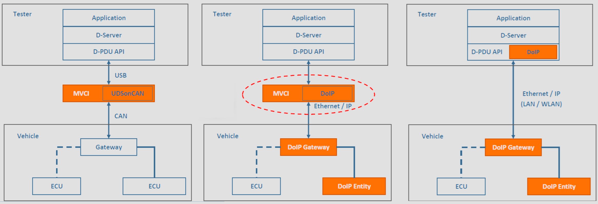

# DoIP

## Motivation für Ethernet-basierte Diagnose

### Einleitung

Die fortschreitende Integration von Fahrerassistenz- und Infotainmentsystemen in moderne Fahrzeuge hat zu einem erheblichen Anstieg des Softwareumfangs geführt. Dieser Trend erstreckt sich nicht nur auf die Fahrzeugproduktion, sondern auch auf den Kundendienst. Parallel dazu entwickeln sich Bedatungskonzepte, insbesondere im Hinblick auf Car2Car- und Car2X-Kommunikation, Ferndiagnose sowie Internetdienste wie Software-Updates über Firmware over the air (FOTA). Dieser wissenschaftliche Text untersucht die Herausforderungen und Motivationen für den Einsatz von Ethernet-basierten Diagnosemethoden in der Automobilindustrie.

### Motivation

Der steigende Softwareumfang und die zunehmende Vernetzung der Fahrzeuge erfordern effiziente Diagnosemethoden. Traditionelle Ansätze, insbesondere über High-Speed-CAN-Busse, stoßen an ihre Grenzen, insbesondere angesichts der Übertragung von Kartensoftware-Updates von bis zu 100 Megabyte über die CAN-Diagnoseschnittstelle mit einer begrenzten Nettoübertragungsrate von 30 Kbyte/s, was etwa einer Stunde Übertragungszeit entspricht. Der Flashumfang von Gesamtfahrzeugen, der teilweise weit über 1 Gigabyte liegt, stellt eine weitere Herausforderung dar.

Ein bedeutender Schritt in Richtung Verbesserung der Übertragungsgeschwindigkeit besteht darin, die Diagnose über Fast Ethernet durchzuführen. Die Nettoübertragungsrate von Fast Ethernet beträgt etwa 6400 Kbyte/s, was im Vergleich zu High-Speed-CAN eine beeindruckende Steigerung um das 375-fache bedeutet. Die Brutto-Übertragungsrate von 100 Mbit/s ermöglicht eine effiziente und schnelle Kommunikation, insbesondere für Diagnosezwecke.

### Herausforderungen

Trotz der klaren Vorteile von Ethernet-basierten Diagnosemethoden gibt es auch Herausforderungen, die es zu bewältigen gilt. Die Integration von Ethernet in die bestehende Fahrzeugarchitektur erfordert möglicherweise umfassende Änderungen und Anpassungen. Die Sicherheit der Datenübertragung muss gewährleistet werden, insbesondere im Kontext von Car2Car- und Car2X-Kommunikation sowie bei Ferndiagnose und Software-Updates.

## Grundlagen

Diagnose over Internet Protocol (DoIP) ist ein fortschrittliches Diagnosekonzept in der Automobilindustrie, das eine flexible und standortunabhängige Diagnose ermöglicht. Anders als herkömmliche Diagnosemethoden ist eine DoIP-Diagnose-Sitzung nicht an einen bestimmten Ort gebunden. Dies ermöglicht es, Fahrzeuge unabhängig von ihrem physischen Standort zu diagnostizieren, was insbesondere in der heutigen globalisierten Welt und vernetzten Mobilität von großem Vorteil ist.

Es ist wichtig zu betonen, dass DoIP selbst kein eigenes Diagnoseprotokoll ist, sondern vielmehr ein Kommunikationsprotokoll, das auf vorhandenen Standards wie dem Internet Protocol (IP) basiert. Der Weg von einem Diagnosetester zum Fahrzeug erfolgt über verschiedene Schichten und erfordert spezifische Komponenten und Konfigurationen.

Für den Diagnosetester spielen Beschreibungsdateien eine entscheidende Rolle. ODX (Open Diagnostic Data Exchange) und CDD (CANdelaStudio diagnostic description) sind gängige Formate solcher Dateien. Jedes Steuergerät im Fahrzeug benötigt eine eigene Beschreibungsdatei, um korrekt identifiziert und diagnostiziert werden zu können. Zusätzlich benötigen sowohl der Diagnosetester als auch jedes Steuergerät im Fahrzeug eine eindeutige logische Adresse, um die Kommunikation zu ermöglichen.

Die Kommunikation zwischen Diagnosetester und Fahrzeug erfolgt über das Internet Protocol (IP) auf verschiedenen Ebenen. Auf der Schicht 3 werden IP-Adressen wie beispielsweise "192.169.1.10" verwendet. Auf der Schicht 4 werden UDP/TCP-Ports genutzt, um den Datenverkehr zu organisieren, zum Beispiel "13400".

Ein weiterer wichtiger Akteur im DoIP-System ist das Diagnose-Gateway, auch als Edge Node bezeichnet. Dieses Gateway agiert als Schnittstelle zwischen dem Fahrzeug und dem Diagnosetester. Die Aktivierungslinie, beispielsweise über einen WWH-OBD Stecker, spielt eine entscheidende Rolle. Sie aktiviert das Ethernet-Interface des Diagnose-Gateways, das normalerweise im ausgeschalteten Zustand verbleibt.

Zusammenfassend ermöglicht DoIP eine moderne und flexible Fahrzeugdiagnose, bei der Diagnosesitzungen nicht mehr an einen bestimmten Ort gebunden sind. Die klare Strukturierung durch logische Adressen, Beschreibungsdateien und die Verwendung von IP-Adressen sowie UDP/TCP-Ports gewährleistet eine effiziente Kommunikation zwischen Diagnosetester, Diagnose-Gateway und den einzelnen Steuergeräten im Fahrzeug.

DoIP Vehicle Discovery

Die Notwendigkeit dieser Umgebungserkennung liegt darin, dass moderne Diagnosetester die Fähigkeit besitzen müssen, mehrere Diagnosesitzungen gleichzeitig zu führen, was die gleichzeitige Kommunikation mit verschiedenen Fahrzeugen erfordert.

Das Verbindungsmanagement ist ein Schlüsselelement, um diese Mehrfachkommunikation zu ermöglichen. Ein Diagnosetester muss in der Lage sein, jedes Fahrzeug innerhalb des Diagnoseumfelds eindeutig zu identifizieren. Dies ist besonders wichtig, um eine klare Zuordnung zwischen dem Tester und den verschiedenen Fahrzeugen herzustellen und sicherzustellen, dass die Diagnoseanfragen präzise an das richtige Fahrzeug gerichtet werden.

Für die eindeutige Identifikation eines Fahrzeugs werden spezifische Fahrzeuginformationen benötigt. Zwei entscheidende Identifikatoren sind die FIN (Fahrzeug-Identifikationsnummer) und die EID (Entity Identification). Die FIN, auch als VIN (Vehicle Identification Number) bekannt, ist eine eindeutige alphanumerische Zeichenkombination, die jedem Fahrzeug zugewiesen ist. Sie dient als Schlüssel zur Identifizierung und Unterscheidung von Fahrzeugen. Auf der anderen Seite repräsentiert die EID die Entity Identification und besteht in den meisten Fällen aus der MAC-Adresse des jeweiligen Steuergeräts im Fahrzeug. Diese Kombination aus FIN und EID gewährleistet eine präzise und eindeutige Zuordnung jedes Fahrzeugs, wodurch eine effiziente Diagnose möglich wird.

Insgesamt ermöglicht DoIP Vehicle Discovery somit nicht nur eine flexible Umgebungserkennung, sondern legt auch den Grundstein für ein effektives Verbindungsmanagement zwischen Diagnosetester und Fahrzeugen. Die eindeutige Identifikation jedes Fahrzeugs durch die Verwendung von FIN und EID gewährleistet eine präzise Kommunikation und ermöglicht es dem Tester, mehrere Diagnosesitzungen gleichzeitig zu führen, ohne die Integrität der Datenübertragung zu beeinträchtigen.

Konfiguration der IP Adressen

Bekanntmachung durch das Fahrzeug

Fahrzeuganfrage durch den Diagnosetester

DoIP Routing Activation

### DoIP Grundlagen Standard ISO 13400

### Diagnostics over IP ISO-Normen

### CAN- und DoIP- Protokoll Analogien

### DoIP ISO 13400-1 Anwendungsfälle

### DoIP Steuergerätekategorien

### DoIP Protokollstapel

### Vorschlag für OBD-Diagnosestecker

## Kommunikationsmechanismen

### DoIP Kommunkationsmechanismen

### DoIP Kommunikationsphasen

### Announcement / Identification

### Diagnoseaufbau: Routing Activation

### Diagnosekommunikation

### Beispiel DoIP Botschaftsablauf

## Diagnosebotschaften / Protokoll

### Ethernet Frame mit DoIP Diagnosenachricht

### Aufbau des DoIP Protokolls

### DoIP Nachrichtengruppen

### DoIP Botschaftstypen

**Node Management:**
Die Nachrichten in der Node-Management-Gruppe dienen der Verwaltung von DoIP-Teilnehmern im Netzwerk. Hierbei werden wichtige Funktionen wie die Ankündigung und Fahrzeugidentifikation (announcement/vehicle identification), die Aktivierung von Routen (routing activation) und der Alive-Check unterstützt. Diese Nachrichten gewährleisten eine effektive Administration und Steuerung der DoIP-Nodes im Netzwerk.

**Vehicle Information:**
In der Vehicle-Information-Gruppe werden sowohl DoIP-Entity-spezifische als auch fahrzeugspezifische Informationen übertragen. Dies umfasst Daten, die für die korrekte Identifikation und Kommunikation mit einem bestimmten Fahrzeug notwendig sind. Die Vehicle-Information-Nachrichten tragen dazu bei, eine präzise und zielgerichtete Diagnose in Verbindung mit spezifischen Fahrzeugen durchzuführen.

**Diagnostics:**
Die Diagnosenachrichten bilden eine entscheidende Nachrichtengruppe im DoIP-Protokoll. Hierbei handelt es sich um Nachrichten, die spezifische Diagnosedaten und -ergebnisse übertragen. Die Diagnostics-Gruppe ermöglicht die effiziente Fehlerdiagnose, Wartung und Fehlerbehebung in Fahrzeugen. Durch den Austausch von Diagnoseinformationen wird eine präzise Lokalisierung von Fehlern und Problemen unterstützt.

| Nachrichtengruppen  | Nachrichtentyp (Identifier) in hexadezimal |
| ------------------- | ------------------------------------------ |
| Node Management     | 0x0XXX                                     |
| Vehicle Information | 0x4XXX                                     |
| Diagnostics         | 0x8XXX                                     |

DoIP-Botschaftstypen und ihre Anwendungen:

- **Generic DoIP Header NACK (Negative Acknowledge):**

  - Payload Type: 0x0000
  - IP Protokoll: UDP/TCP
  - Anwendung: Meldung des Gateways bei Fehlern im DoIP-Header. Enthält einen Fehlercode, beispielsweise 0x00 Incorrect Pattern Format.
- **Vehicle Identification Request:**

  - Payload Type: 0x0001, 0x0002 mit EID, 0x0003 mit VIN
  - IP Protokoll: UDP
  - Anwendung: Abfrage der Fahrzeugerkennungen durch den Tester.
- **Vehicle Announcement Message / Vehicle Identification Response:**

  - Payload Type: Request: 0x0004, Response: 0x0005
  - IP Protokoll: UDP
  - Anwendung: Ankündigung des Fahrzeugs, dass ein DoIP-Gateway vorhanden ist. Die Antwort enthält die Fahrzeugidentifikation.
- **Routing Activation Request/Response:**

  - Payload Type: Request: 0x0005, Response: 0x0006
  - IP Protokoll: TCP
  - Anwendung: Aktivierung der Weiterleitung von Diagnosebotschaften von/zum internen Fahrzeugnetz.
- **Alive Check Request/Response:**

  - Payload Type: Request: 0x0007, Response: 0x0008
  - IP Protokoll: TCP
  - Anwendung: Aufrechterhalten der TCP/IP-Verbindung, falls über längere Zeit keine Diagnosebotschaft ausgetauscht wird.
- **DoIP Entity Status Request/Response:**

  - Payload Type: Request: 0x4001, Response: 0x4006
  - IP Protokoll: UDP
  - Anwendung: Abfrage zum Typ des DoIP-Gerätes (Gateway oder normales Steuergerät) und zur Anzahl der möglichen Verbindungen (TCP/IP-Sockets).
- **Diagnostic Power Mode Info Request/Response:**

  - Payload Type: Request: 0x4003, Response: 0x4004
  - IP Protokoll: UDP
  - Anwendung: Abfrage, ob Fahrzeugnetzwerke aktiv sind (Zündung ein usw.).
- **Diagnostic Message Request Diag. ACK/NACK:**

  - Payload Type: 0x8001, pos ACK: 0x8002, neg ACK: 0x8003
  - IP Protokoll: TCP
  - Anwendung: Austausch von Diagnosebotschaften.

## Anwendungsfälle

### Diagnose klassicher Anwendungsfall

## Zusammenfassung

Die Nutzung des Diagnostic Communication over Internet Protocol (DoIP) ermöglicht einen breitbandigen Fahrzeugzugang für die Fahrzeugproduktion und den Servicebereich. Im Vergleich zu High-Speed CAN mit einer Datenrate von 500 Kbit/s bietet DoIP eine beeindruckende 200-mal höhere Bruttodatenrate von 100 Mbit/s. Diese Technologie ermöglicht eine flexible Tester-Fahrzeug-Vernetzung, sowohl für lokale als auch für Remote-Diagnosen. Die Kommunikation kann dabei über Kabel (LAN) oder kabellos (WLAN) erfolgen.

Ein besonderes Merkmal von DoIP ist die Verwendung weit verbreiteter Standardtechnologien wie Ethernet und das IP-Protokoll. Dies beinhaltet Ethernet-Controller, 100Base-TX-Leitungen und RJ-45-Stecker. Ein weiterer Vorteil besteht darin, dass bei Nichtverwendung der Ethernet-Aktivierung der optionale Wegfall eines bei CAN notwendigen Vehicle Communication Interface (VCI) möglich ist.

Die Vernetzte Diagnose ermöglicht eine zentralisierte Bereitstellung von Diagnosesystemen über die Cloud. Dies optimiert nicht nur den Zugriff auf Fahrzeugdaten, sondern ermöglicht auch eine effiziente Überwachung und Wartung von Fahrzeugen auf globaler Ebene. Bei der Implementierung von DoIP sind jedoch Sicherheitsaspekte zu beachten, insbesondere im Hinblick auf die Abwehr von potenziellen Cyberattacken. Die Integration von robusten Sicherheitsprotokollen ist daher unerlässlich, um die Integrität und Vertraulichkeit der Fahrzeugkommunikation zu gewährleisten.

## Abkürzungen

| Abkürzung | Bedeutung                                        |
| ---------- | ------------------------------------------------ |
| ACK        | Acknowledge                                      |
| ARP        | Address Resolution Protocol                      |
| CAN        | Controller Area Network                          |
| Car2Car    | Car-to-Car Communication                         |
| Car2X      | Car-to-External Communication                    |
| CRC        | Cyclic Redundancy Code                           |
| DHCP       | Dynamic Host Configuration Protocol              |
| DIS        | Draft International Standard                     |
| DoIP       | Diagnostic communication over Internet Protocol  |
| ECU        | Electronic Control Unit                          |
| EID        | Entity Identification                            |
| GID        | Group Identification                             |
| ICMP       | Internet Control Message Protocol                |
| IEEE       | Institute of Electrical and Electronic Engineers |
| IP         | Internet Protocol                                |
| ISO        | International Organization for Standardization   |
| LAN        | Local Area Network                               |
| MAC        | Media Access Control                             |
| NACK       | Not Acknowledge                                  |
| NDP        | Neighbor Discovery Protocol                      |
| PHY        | Physical Layer                                   |
| SID        | Service Identifier                               |
| TCP        | Transmission Control Protocol                    |
| UDP        | User Datagram Protocol                           |
| UDSonIP    | Unified Diagnostic Services on Internet Protocol |
| VCI        | Vehicle Communication Interface                  |
| VIN        | Vehicle Identification Number                    |
| WLAN       | Wireless Local Area Network                      |
| WWHOBD     | World Wide Harmonized On-Board-Diagnostic        |

Ethernet Frame mit DoIP Diagnosenachricht

