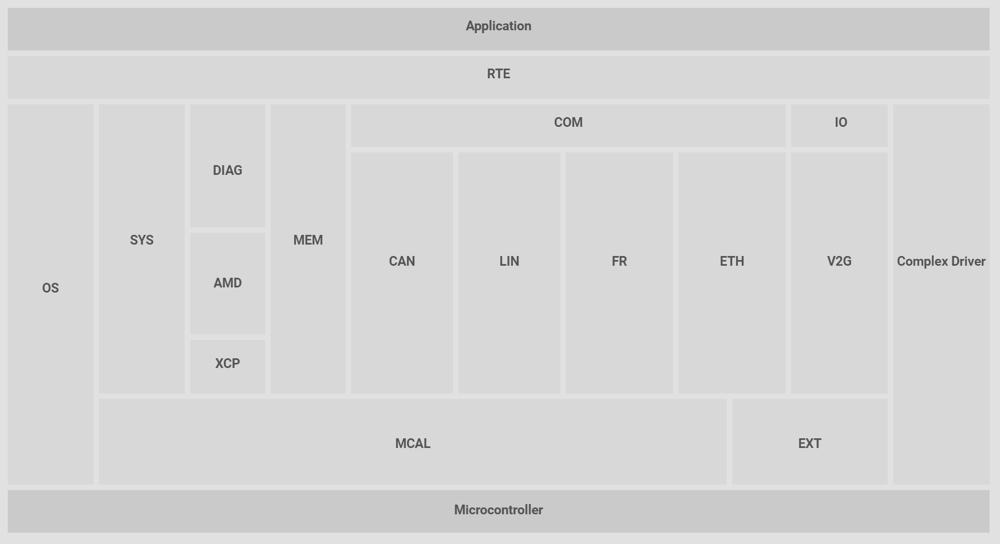
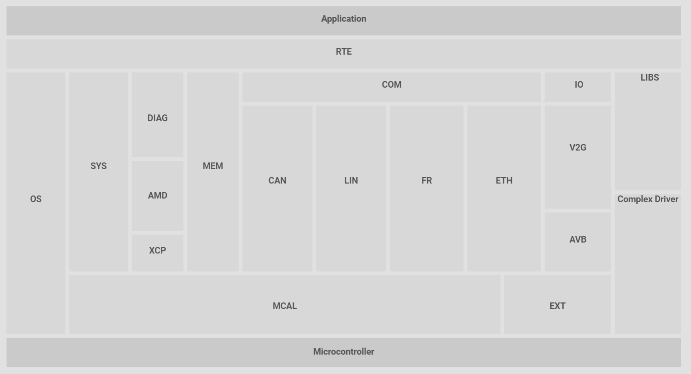
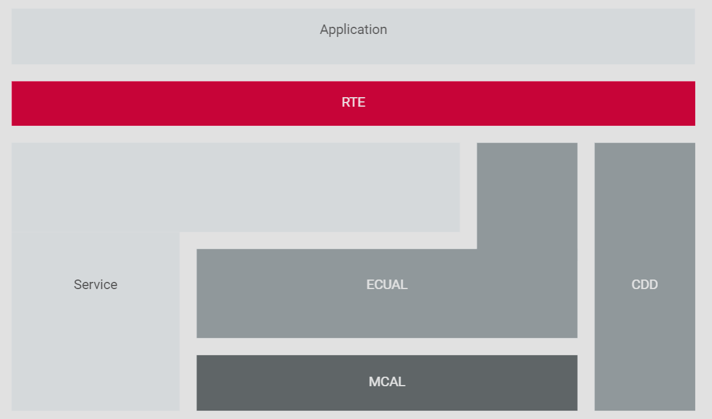
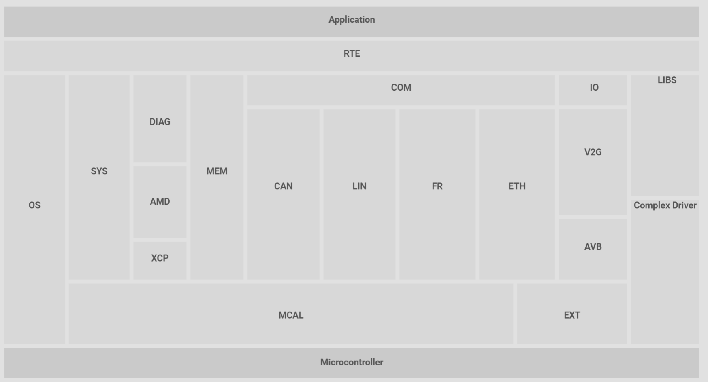
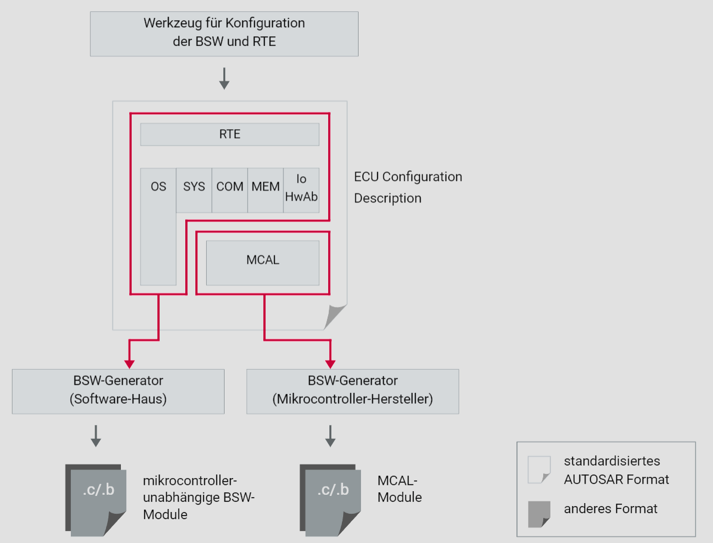

# Basissoftware und RTE

## Aufgabenbereich der Basissoftware

VFB
Ein System ist in Form von Softwarekomponenten beschrieben, welche über den VFB (bzw. steuergerätespezifische RTEs) untereinander verbunden sind. Diese abstrakte Beschreibung könnte suggerieren, dass AUTOSAR Basissoftware nur die Kommunikation abdeckt. Dies ist nicht der Fall.

steuergeräteinterne Dienste
Eine AUTOSAR Basissoftware bedient auch steuergeräteinterne Dienste wie Zustandsverwaltung (Steuergerätezustand und Steuerung der Kommunikationskanäle), Diagnosedienste, Watchdog-Dienste, Betriebssystem und die Verwaltung des nichtflüchtigen Speichers; selbst IO wird im Umfang der Standardisierung durch AUTOSAR behandelt.

MCAL
Speziell mit der Standardisierung des zuletzt genannten Themas (Ein- und Ausgabe) kommen die Halbleiterhersteller ins Spiel. Sie treten als Zulieferer der niedrigeren, hardwarenahen Softwareschicht (MCAL) auf. Durch die Standardisierung werden Themen, die vormals durch die Steuergerätelieferanten selbst gelöst wurden, auch zu einem neuen Geschäftsfeld der Lieferanten von Basissoftware.

In den Medienobjekten zur Software-Architektur wird die Vector Umsetzung des AUTOSAR Standards – MICROSAR – dargestellt.

## Eigenschaften der Basissoftware

Abstraktion
Die Abstraktion in Form von Softwarekomponenten ist nur möglich, indem die dazu nötigen Mechanismen auf Ebene der Basissoftware bereitgestellt werden.

Daher ergänzt die Basissoftware die RTE um diese Mechanismen. Besonders deutlich zeigt sich das beim Kommunikationsstack und dem Betriebssystem, die beide eng mit der RTE und deren Betrieb verwoben sind.

Aufgaben der Basissoftware
Die Basissoftware (BSW) muss beispielsweise Events erzeugen und Zeitgeber für die RTE bereitstellen. Über Kommunikationsbusse transportiert die BSW außerdem Daten über Steuergerätegrenzen hinweg. Beim Ausführen von nebenläufigen Runnable Entities innerhalb der Softwarekomponenten, gehören sowohl die Ablaufsteuerung als auch das Verwalten von Systemzuständen zu den Aufgaben der Basissoftware. Des Weiteren stellt sie Synchronisationsprimitive zur Verfügung, um nebenläufige Zugriffe zu serialisieren.

## Die RTE und deren optimale Konfiguration

Um die in der Beschreibung der Softwarekomponenten enthaltenen Kommunikations- und Aufrufmechanismen realisieren zu können, wird eine effiziente Laufzeitumgebung (RTE) benötigt.

Erzeugung der RTE
Dank der formalen Beschreibung der SWCs eröffnet sich die Möglichkeit, das Software Design automatisch zu analysieren, daraus eine optimierte Laufzeitumgebung abzuleiten und zu generieren. In dieser formalisierten Beschreibung eines Softwaredesigns ist beispielsweise enthalten, in welchem Kontext ein Runnable Entity aufgerufen wird, und ebenfalls wie es mit anderen Teilen derselben oder einer anderen SWC in Interaktion tritt.

Wenn man weitere Randbedingungen wie die Konfiguration der Basissoftware betrachtet, kann man Entscheidungen treffen, wie ein Funktionsaufruf optimal implementiert werden kann.

Festlegungen
Es müssen grundsätzlich Entscheidungen getroffen werden über

die Verwendung und die Auswahl des Sperrmechanismus gegen den nebenläufigen Zugriff aus anderen Runnable Entities.
die Methode des Aufrufs.
Er erfolgt entweder direkt (als Makro oder C-Funktionsaufruf) oder mittelbar durch ein RTE Event, das mit Hilfe des Betriebssystems ausgelöst wird.
die Art und Weise eines Schreib- oder Lesezugriffs.
Dies kann entweder der Zugriff auf eine Variable sein, oder auch der Aufruf einer API der Basissoftware. Die Semantik verschiedener Zugriffsarten ist hier ebenso zu berücksichtigen wie die Mechanismen, mit denen sie umgesetzt sind.
Je nach Konfiguration kann diese Auswahl mehr oder weniger günstig getroffen werden.

Optimierungen
Im Allgemeinen sollte der Generator der Laufzeitumgebung für einen sparsamen Einsatz von OS Events und Alarmen sorgen. Durch eine geschickte Konfiguration des Systems können jedoch zusätzliche, wesentlich größere Einsparungen beim Ressourcenverbrauch und der Laufzeit erzielt werden. Dazu ist es nötig, die Auswirkungen bestimmter Entwurfsentscheidungen während der Designphase der Softwarekomponenten zu kennen.

## OEM-Abhängigkeiten in der Basissoftware

Modularität
Ein Kennzeichen der AUTOSAR Basissoftware ist der hohe Grad der Modularisierung. Diese Modularisierung erfolgt horizontal in unterschiedlichen Aufgabengebieten (clusters) und vertikal in unterschiedlichen Abstraktionsebenen oder Schichten (layers). AUTOSAR erlaubt eine unterschiedliche Granularität der Basissoftware (Implementation Conformance Classes, ICC). Dies ermöglicht die Zusammenfassung (clustering) von BSW-Modulen bis hin zur monolithischen Basissoftware, bestehend aus nur einem Modul, das die Basissoftware funktional abdeckt.

AUTOSAR Basissoftware ist nicht notwendigerweise OEM-spezifisch, jedoch gibt es einige Punkte, in denen sich die BSW Stacks der OEMs typischerweise unterscheiden.

OEM spezifische Stacks
Beispielsweise unterscheiden sich die Stacks in der Anzahl und dem Aufgabenbereich bestimmter BSW-Module, die nicht Teil des AUTOSAR Standards sind. Es gibt aber auch funktionale Erweiterungen der AUTOSAR Basissoftware in Form von Softwarekomponenten, die dem Stack hinzugefügt werden.

In der Struktur der Basissoftware treten solche Variationen auf folgenden Gebieten auf:

DIAG: Diagnostic Event Manager, Diagnostic Communication Manager
SYS: Communication Channel Handling
COM: Network Management
COM: Gateway Funktionalität
spezifische Dienste wie Verschlüsselungsmodule, proprietäre Transportprotokolle, etc.
OEM spezifische Prozesse
Was die Konfiguration der Basissoftware betrifft, gibt es bei verschiedenen OEMs auch Unterschiede in den Arbeitsabläufen:

in der Art und Weise wie OEM-Vorgaben eingespeist werden (.dbc-Datei, ECU Extract of System Description oder separate SWC Beschreibungen)
Ausgestaltung und Bedatung der Diagnose (ODX, CANdela-Datei, …)
generelle Anforderungen wie z.B. Fähigkeit zur Post-Build-Konfiguration des Kommunikationsstacks, Library-Lieferungen an die Lieferanten
Im Medienobjekt zur Software-Architektur wird die Vector Umsetzung des AUTOSAR Standards – MICROSAR – dargestellt.

## Woher kommt die Basissoftware

Bei unterschiedlichen OEMs variiert die Art und Weise, wie die Zulieferer mit der Basissoftware umgehen müssen.

Fokus detaillierte Vorgaben
So gibt es Modelle, bei denen der OEM die hardwareunabhängigen Teile der Basissoftware bei einem bestimmten Softwarehersteller bereits lizensiert hat. Der Zulieferer muss dann nur noch die hardwareabhängigen Teile beziehen. Teilweise stellt der OEM dem Zulieferer für eine Auswahl an Zielplattformen auch komplett vorintegrierte Basissoftwarepakete kostenfrei zur Verfügung.

Fokus funktionale Vorgaben
Es gibt auch noch andere Modelle, bei denen der OEM nur die Funktionalität der Basissoftwaremodule vorgibt, die technische Umsetzung und Integration aber vollständig dem Zulieferer des Steuergerätes überlässt. Dieser kann dann die Module bei einzelnen Softwareherstellern beziehen. Die eingekauften Module kann der Zulieferer dann selbst zu einem Basissoftwarepaket integrieren, oder dies bereits durch einen Softwarehersteller erledigen lassen.

Eigenentwicklungen der Zulieferer
Einige große Zulieferer besitzen Eigenentwicklungen der AUTOSAR Basissoftware und treten daher auch als Softwarehersteller dieser Eigenentwicklungen auf. Je nach Zusammenarbeit mit dem OEM gibt es bestimmte Absprachen über die Verwendung dieser Software.

