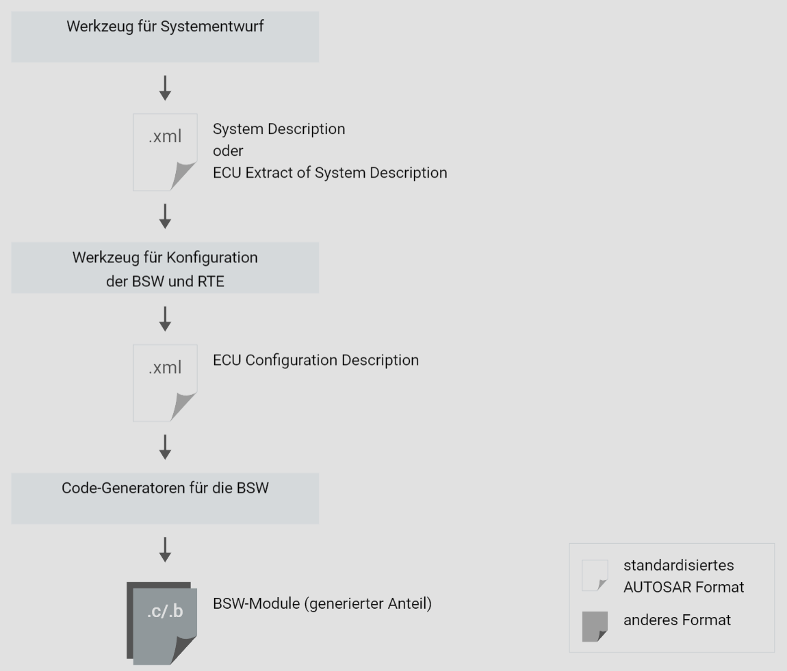
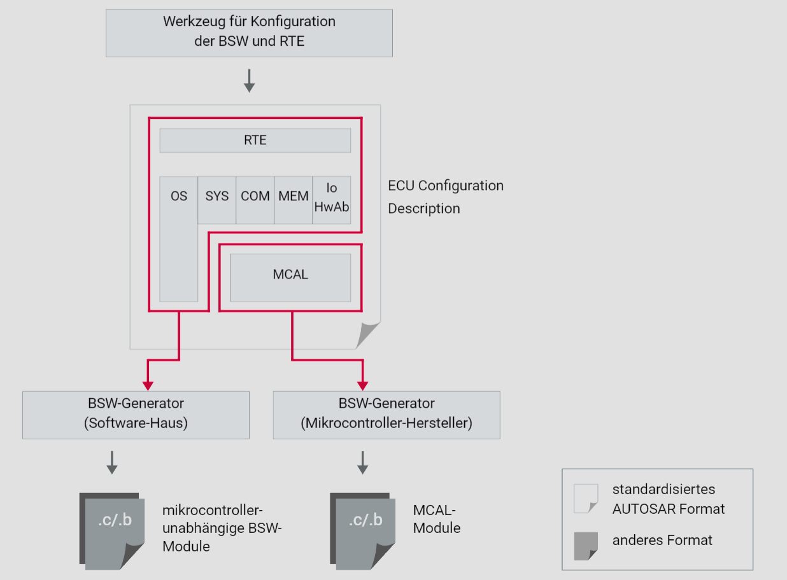
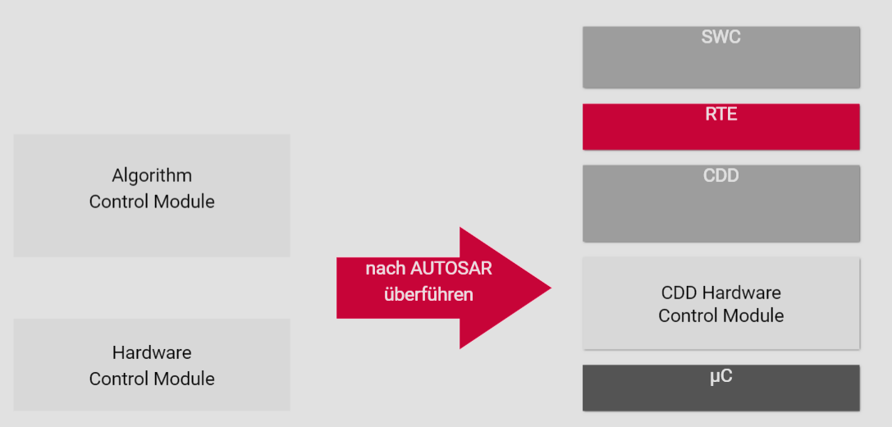
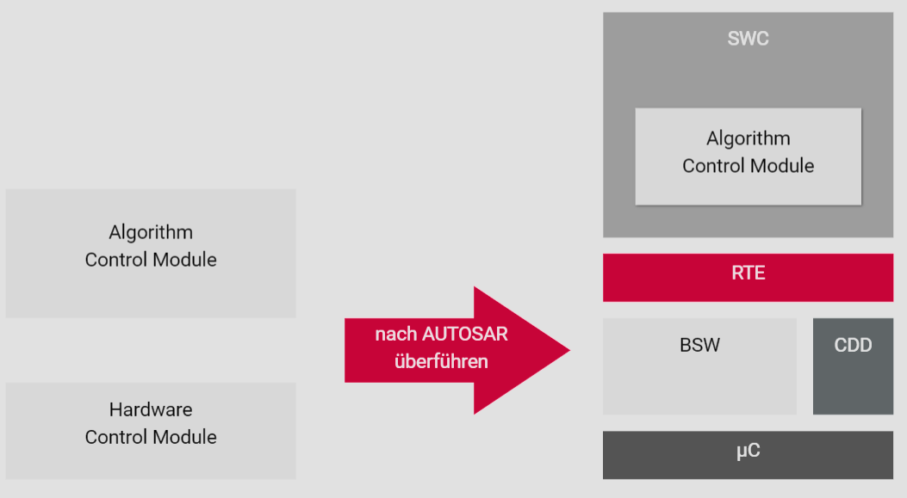

# Werkzeuge, Umstieg und Test

## Werkzeuge

Aufgaben der Werkzeuge
Während der Entstehung eines AUTOSAR Steuergerätes kommen verschiedene Werkzeuge zum Einsatz. Die Aufgaben dieser Werkzeuge lassen sich grob nach folgenden Typen unterscheiden:

Werkzeuge für Systementwurf
Diese Werkzeuge dienen zur Definition der Netzwerkarchitektur und -kommunikation sowie Entwurf und Verteilung der SWCs.
Werkzeuge für die Konfiguration der Basissoftware und der RTE
Diese Werkzeuge kommen zum Einsatz, um eine Konfigurationsbeschreibung der BSW-Module des Steuergerätes zu erstellen (ECU Configuration Description).
Code-Generatoren für BSW-Module
Auf Basis der ECU Configuration Description erzeugen Code-Generatoren spezifisch angepasste BSW-Module für das Steuergerät.
Austauschformat
Diese Aufgaben werden typischerweise von unterschiedlichen Werkzeugen wahrgenommen. Ein wichtiger Bestandteil von AUTOSAR ist daher ein standardisiertes XML-Format, auf dessen Basis Entwurfs- und Konfigurationsdaten zwischen verschiedenen Werkzeugen ausgetauscht werden können.

Diese Standardisierung ist essentiell, da typischerweise Werkzeuge unterschiedlicher Hersteller im gleichen Entwicklungsprojekt zum Einsatz kommen. So kann zum Beispiel die mikrocontroller-unabhängige BSW von einem Softwarehaus kommen, während der MCAL samt passenden Code-Generatoren vom Halbleiter-Hersteller bereitgestellt wird.

Potentiell könnte sogar für jedes BSW-Modul ein separates Werkzeug eingesetzt werden. Aus praktischer Sicht ist es allerdings empfehlenswert, die Konfiguration der BSW über ein einheitliches Werkzeug durchzuführen.

## Migrationslösungen

legacy Software
AUTOSAR sieht bereits im Standard vor, dass auch Steuergerätesoftware in die AUTOSAR Welt übertragen werden kann, die nicht nach der AUTOSAR Methode entwickelt wurde. Dazu definiert man gemäß AUTOSAR einen spezifischen Complex Driver.

Ein Complex Driver kann als eine spezielle Art von SWC betrachtet werden, die nicht zwingend eine nach dem SWC Template formalisierte Beschreibung haben muss.

Complex Driver
Ein komplexer Gerätetreiber darf ohne die RTE zu benutzen auf die AUTOSAR Basissoftware direkt zugreifen. So wird aus Sicht der Anwendung „nur“ die Basissoftware ausgetauscht, während die Applikation weitgehend bleiben kann wie sie ist. Die Applikation kann also im Rahmen der Migration als komplexer Gerätetreiber aufgefasst werden. Dies kann als erster Schritt in Richtung einer AUTOSAR Software-Architektur verstanden werden. Dieser erste Schritt ist vom Entwicklungsaufwand gesehen die kostengünstigste Variante.

direkte Vorteile
Bereits hier kann man jedoch schon von Teilen der AUTOSAR Funktionalität profitieren, indem man z.B. zyklische Anteile der Applikation durch die RTE aufrufen lässt oder Kommunikation und Diagnose über die RTE laufen lässt während der Applikationskern noch nicht AUTOSAR konform umgesetzt ist.

weitere Schritte
Langfristig eliminiert man die nicht nach AUTOSAR modellierten Teile der Applikation, insbesondere alle Task-Körper und Aufrufe ins Betriebssystem sowie alle Stellen mit Interruptsperre und andere Basissoftwarezugriffe. Diese werden durch AUTOSAR konforme Elemente ersetzt. Auf diese Weise sind die Applikationsteile bei einem guten Design dann effizienter umgesetzt als früher.
