# AUTOSAR

## Grundlagen

### Motivation

Innovative Fahrzeugfunktionen führen zu einer stetigen Zunahme der Komplexität der E/E-Fahrzeugarchitektur. Die Anforderungen an die Entwicklung sind dabei oftmals widersprüchlich. So sollen zusätzliche Fahrerassistenzsysteme kritische Fahrmanöver unterstützen, gleichzeitig sollen Verbrauchswerte gesenkt und Umweltstandards eingehalten werden. Aus der immer tieferen Integration von Infotainment und Kommunikation mit der direkten Fahrzeugumgebung und Onlinediensten ergeben sich weitere Herausforderungen.

Um diesen Anforderungen auch zukünftig gerecht zu werden, bedarf es eines neuen technologischen Ansatzes für die Software-Architektur der Steuergeräte. Anders können die steigenden Anforderungen von Seiten der Kunden, aber auch des Gesetzgebers nicht erfüllt werden.

Im Jahr 2003 schlossen sich Kfz-Hersteller und Zulieferer zur AUTOSAR Initiative zusammen, um an diesem neuen Ansatz zu arbeiten. Das Ziel der Initiative ist es, die ständige Neuentwicklung gleicher oder ähnlicher Softwarekomponenten einzudämmen. Weiterhin soll eine Grundlage für die Zusammenarbeit bei Basisfunktionen geschaffen werden, die aber auch Raum für Wettbewerb bei innovativen, neuen Funktionen bietet.

Der von der Initiative definierte AUTOSAR Standard bildet die Basis für zukünftige Fahrzeuganwendungen und hilft, Grenzen zwischen einzelnen Domänen besser zu überbrücken. Durch die Möglichkeit, Software flexibel im Steuergerätenetz zu verteilen, ergeben sich zusätzliche Möglichkeiten einer systemweiten Optimierung.

### AUTOSAR Initiative

Die AUTOSAR Initiative ist eine weltweite Entwicklungspartnerschaft von Automobilherstellern, Automobilzulieferern und weiteren Unternehmen der Software-, Halbleiter- und Elektronikindustrie.

Unter dem Slogan **"Cooperate on Standards, Compete on Implementation"** arbeiten die Mitglieder mit unterschiedlichen Rechten und Pflichten in Arbeitsgruppen zusammen. Während die Core Partner entscheiden, wer in das AUTOSAR Konsortium aufgenommen wird, definieren die Premium Mitglieder den Standard.

Folgende Ziele hat AUTOSAR:

- Standardisierung von Schnittstellen zwischen Funktionen der Anwendungssoftware und zu Basisfunktionen
- Definition einer Referenzarchitektur für Steuergerätesoftware
- Standardisierung von Austauschformaten für verteilte Entwicklungsprozesse

Damit erhoffen sich die beteiligten Unternehmen Vorteile wie:

- Optimierbarkeit des Steuergerätenetzwerks durch flexibles Integrieren, Verschieben und Austauschen von Funktionen
- Beherrschung der steigenden Produkt- und Prozesskomplexität
- Wartbarkeit über den gesamten Produktlebenszyklus

AUTOSAR hat mit der Version 3.0 die erste Version herausgebracht, welche in Seriensteuergeräten zum Einsatz kommt.

Natürlich hat der AUTOSAR Standard auch seine Grenzen. So beinhaltet AUTOSAR beispielsweise keine Beschreibung des funktionalen Verhaltens einer Softwarekomponente.

### AUTOSAR Konzept

Elemente der AUTOSAR Architektur sind unter anderem formal definierte Softwarekomponenten (SWCs) mit eindeutig spezifizierten Schnittstellen zur Basissoftware (BSW). Von den Modulen dieser Basissoftware werden grundlegende Standarddienste bereitgestellt, wie z.B. Buskommunikation, Speicherverwaltung, IO-Zugriff, System- und Diagnosedienste.

Ein weiteres Element von AUTOSAR ist die Laufzeitumgebung RTE, die die Verbindung zwischen SWCs und von SWCs zur Basissoftware steuert.

Der von AUTOSAR spezifizierte Virtual Functional Bus (VFB) liefert den konzeptionellen Unterbau für die Kommunikation von SWCs untereinander und für die Nutzung von BSW-Diensten. Die komplette Kommunikation der SWCs basiert auf dem VFB, dadurch sind sie unabhängig von der Steuergeräte-Hardware. Sie lassen sich einfacher wiederverwenden und in verschiedenen Projekten auf unterschiedlichen Plattformen einsetzen. Realisiert wird der VFB für ein konkretes Fahrzeug, indem für jedes Steuergerät eine spezifisch konfigurierte RTE in Verbindung mit der passend konfigurierten BSW zum Einsatz kommt.

### AUTOSAR Schichtenmodell

In AUTOSAR wird die Steuergerätesoftware abstrahiert und in Basissoftware, Laufzeitumgebung und Anwendungsschicht unterteilt.

Die Basissoftware besteht aus einer Vielzahl vordefinierter Module, die in Schichten zusammengefasst sind.

Der Microcontroller Abstraction Layer (MCAL) bietet beispielsweise Treiber für den Zugriff auf Speicher, Kommunikation und Input/Output (IO) des Mikrocontrollers.

Der ECU Abstraction Layer (ECUAL) bietet einen einheitlichen Zugriff auf alle Funktionalitäten eines Steuergeräts wie Kommunikation, Speicher oder IO - unabhängig davon, ob diese Funktionalitäten Bestandteil des Mikrocontrollers sind oder durch Peripheriekomponenten realisiert werden.

Der Service Layer stellt verschiedene Arten von Hintergrunddiensten wie Netzwerkdienste, Speicherverwaltung und Buskommunikationsdienste für die Anwendungsschicht bereit. Das Betriebssystem ist ebenfalls in dieser Schicht enthalten.

Die Runtime Environment (RTE) abstrahiert die Anwendungsschicht von der Basissoftware. Weiterhin ist sie die Laufzeitumgebung der Anwendungsschicht und realisiert den Datenaustausch.

Die Anwendungsschicht realisiert die Anwendungsfunktionalität des Steuergeräts und besteht aus einzelnen Softwarekomponenten.

Dieses Schichtenmodell ermöglicht eine einfachere Portierung von Software auf unterschiedliche Hardware. Eine solche Portierung hat bisher bei ungünstig konzipierten Software-Architekturen eine umfangreiche Anpassung an verschiedenen Stellen bis hin zur Anwendungsschicht zur Folge. Mit AUTOSAR werden lediglich alle mikrocontroller-spezifischen Treiber im MCAL ersetzt. Die Module im ECU Abstraction Layer müssen nur neu konfiguriert werden. Alle weiteren Schichten sind von der Portierung nicht betroffen. Somit reduzieren sich der Implementierungs- und Testaufwand und das damit verbundene Risiko deutlich.

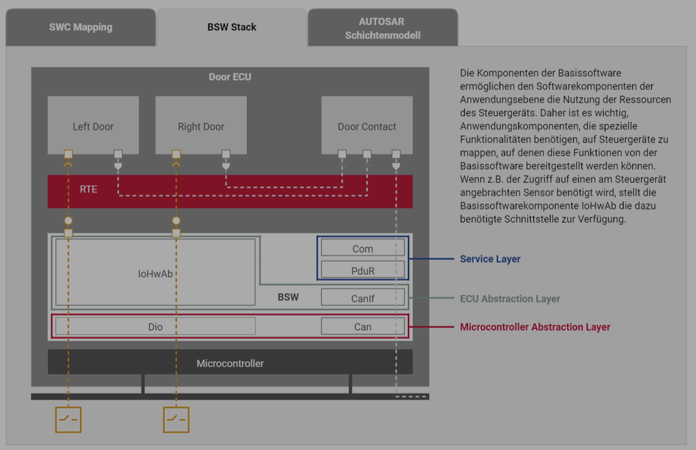

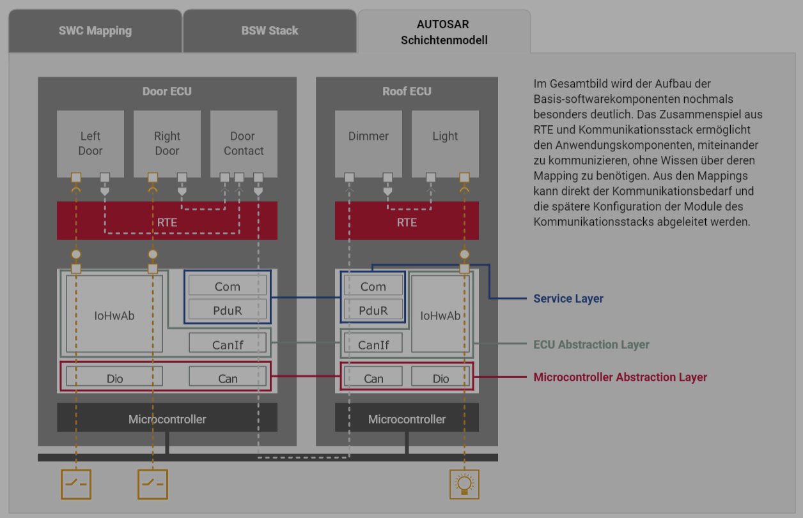

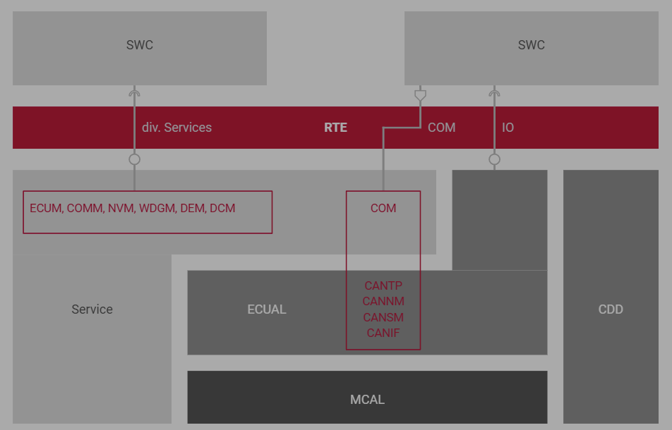

### Schnittstellendefinitionen in AUTOSAR

AUTOSAR unterscheidet drei Typen von Schnittstellen:

- AUTOSAR Interface
- Standardized AUTOSAR Interface
- Standardized Interface

Das AUTOSAR Interface ist eine generische Schnittstelle, die von den Ports einer SWC abgeleitet wird. AUTOSAR Interfaces werden von der RTE bereitgestellt und dienen als Schnittstellen zwischen SWCs oder zwischen einer SWC und der Steuergeräte-Firmware (IoHwAb, Complex Drivers). Über diese Schnittstellen kann eine SWC beispielsweise einen Eingangswert lesen oder einen Ausgangswert schreiben.

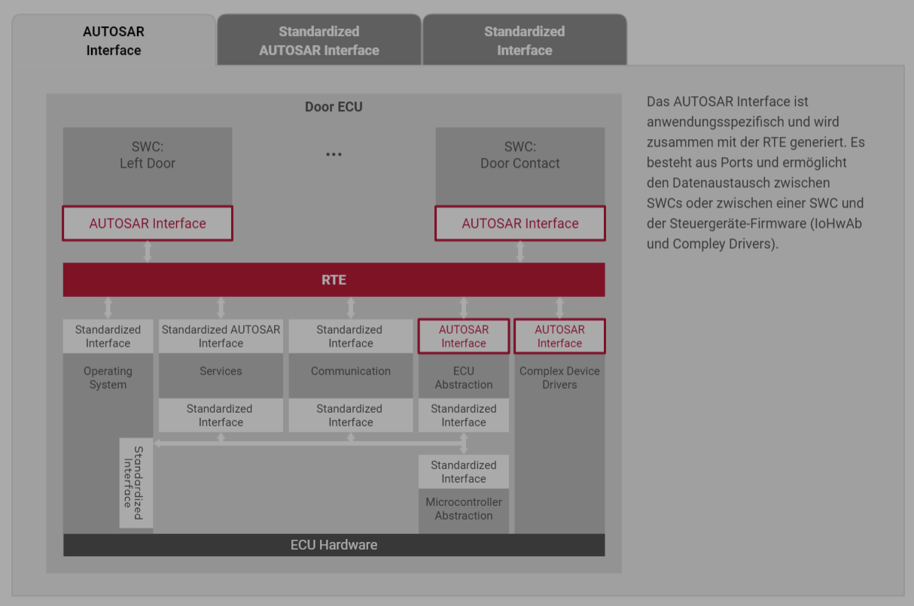

Das Standardized AUTOSAR Interface ist ein besonderes AUTOSAR Interface, das durch den AUTOSAR Standard bereits vordefiniert ist. Derartige Schnittstellen werden von den SWCs für den Zugriff auf AUTOSAR Services verwendet, die von BSW-Modulen des Service Layers wie dem ECU State Manager oder dem Diagnostic Event Manager bereitgestellt werden.

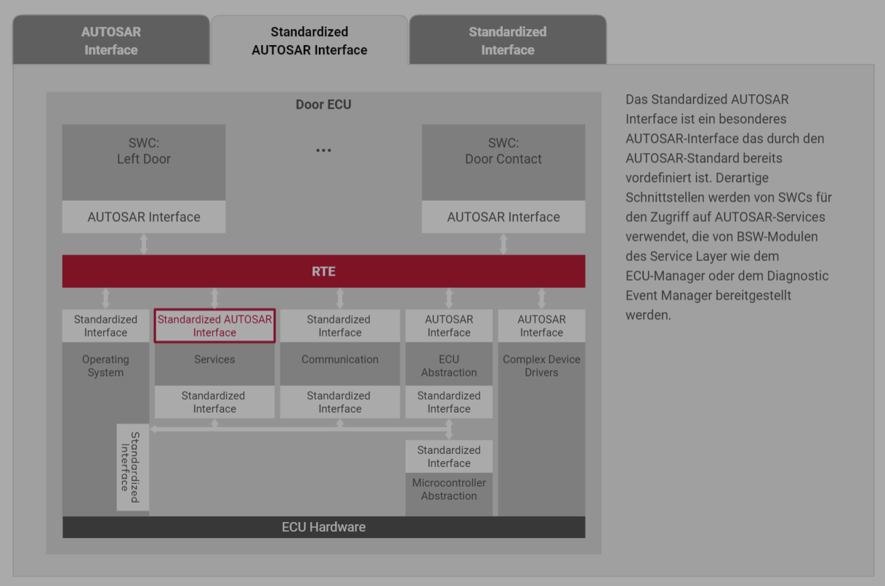

Das Standardized Interface ist eine Schnittstelle, die durch den AUTOSAR Standard als API in der Sprache C vordefiniert ist. Sie wird zwischen BSW-Modulen in einem Steuergerät, zwischen RTE und Betriebssystem oder zwischen der RTE und dem BSW-Modul Com verwendet.

## AUTOSAR Methodik

### Entwicklungsphasen

Die Methode zur Entwicklung von Steuergeräte-Software wurde von der AUTOSAR Organisation in der AUTOSAR Methodik definiert. Sie unterteilt den Entwicklungsprozess in Aktionen und standardisiert den Datenaustausch zwischen den Entwicklungspartnern mit einem Satz von XML-Dateien.

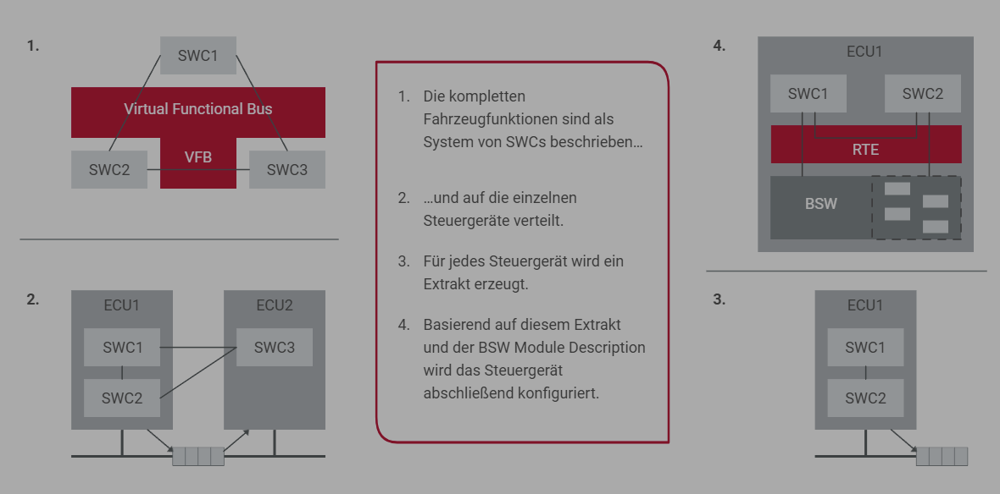

Beim Systementwurf wird die Architektur der Anwendung festgelegt. Dies geschieht durch die Definition von SWCs und deren Verteilung auf die Steuergeräte. Auch die Netzwerkkommunikation wird in diesem Schritt bestimmt. Das Ergebnis ist die System Description – eine AUTOSAR XML-Datei, aus der für jedes Steuergerät ein spezifischer ECU Extract of System Description erzeugt wird.

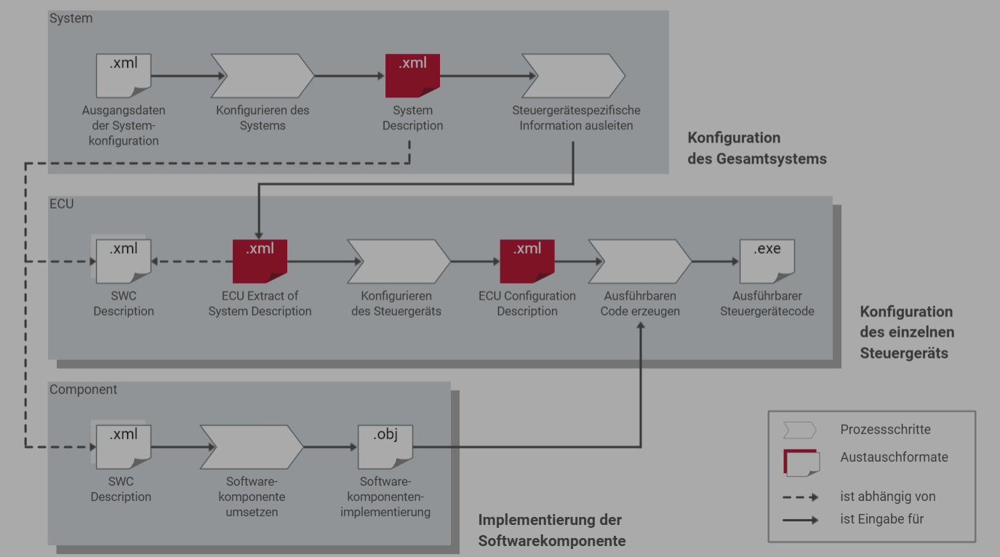

Während der Steuergeräteentwicklung werden die SWCs implementiert, sowie die BSW und die RTE konfiguriert. Durch die Konfiguration bestimmt der Entwickler den für sein Projekt benötigten Umfang der Basissoftware. Dadurch kann er die gesamte Steuergeräte-Software optimieren. Als Ergebnis der Konfiguration erhält er eine ECU Configuration Description (AUTOSAR XML-Datei), die auf den ECU Extract of System Description abgestimmt ist.

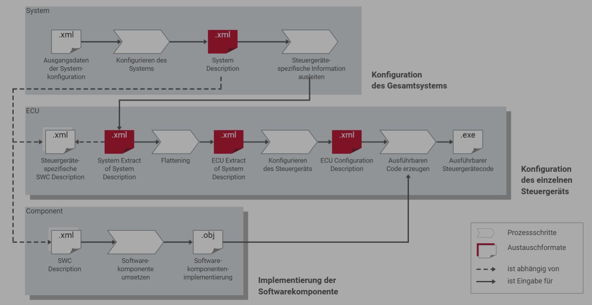

Basierend auf der ECU Configuration Description wird durch den Einsatz von Codegeneratoren die Basissoftware für die Steuergeräte-Software erzeugt bzw. angepasst. Auch die RTE wird steuergerätespezifisch erzeugt.

Die Applikationsentwicklung kann losgelöst betrachtet werden. Die Schnittstellen der SWCs werden in den SWC Descriptions (AUTOSAR XML-Datei) beschrieben. Auf Basis dieser Beschreibung kann die SWC unabhängig von anderen SWCs implementiert und getestet werden. Dadurch ist das einfache Zusammenspiel der Applikationskomponenten von OEM und Tier1 möglich.

### AUTOSAR Austauschformate

#### Allgemeine Formate

Folgende Austauschformate werden von AUTOSAR definiert:

**SWC Description:**

- Der Zulieferer oder der OEM definiert die SWCs. Hierzu erstellt er für jede SWC eine XML-Datei, die SWC Description.
- Diese beschreibt die Schnittstellen und den Ressourcen-Bedarf der SWC.
- Im Anschluss erstellt er dazu passend die C-Dateien für die Implementierung.

**System Description:**

- Der OEM definiert auf Basis der SWCs zuerst den Funktionsumfang für das gesamte Fahrzeug unabhängig von den Steuergeräten.
- Als nächstes entwirft er die Kommunikationsnetzwerke und verteilt die SWCs auf die vorhandenen Steuergeräte.
- Das Ergebnis wird in der System Description gespeichert.

#### Ab AUTOSAR 4.0

**System Extract of System Description:**

- Für jedes Steuergerät reduziert der OEM die System Description zu einem System Extract of System Description, das der OEM an die Zulieferer des entsprechenden Steuergeräts weitergeben kann.
- Diese Datei ersetzt zur Konfiguration der BSW-Module die bislang verwendeten .dbc-, FIBEX- oder .ldf-Dateien.
- ECU Extract of System Description (ECUEX): Durch ein sogenanntes Flattening wird aus dem System Extract of System Description ein ECU Extract of System Description, erzeugt.
- Dieser entspricht dem System Extract, enthält aber nur die atomaren SWCs in einer flachen Sicht. Der ECU Extract kann vom TIER1 um eigene SWCs erweitert werden.

#### AUTOSAR 3

**ECU Extract of System Description (ECUEX):**

- Für jedes Steuergerät reduziert der OEM die System Description zu einem ECU Extract of System Description, das der OEM an die Zulieferer des entsprechenden Steuergeräts weitergeben kann.
- Diese Datei ersetzt zur Konfiguration der BSW-Module die bislang verwendeten .dbc-, FIBEX- oder .ldf-Dateien.

**Complete ECU Extract of System Description:**

- Ausgehend vom ECU Extract of System Description integriert der Zulieferer seine eigenen SWCs.
- Das Ergebnis ist ein vollständiger und aktueller ECU Extract of System Description, der nun die Beschreibung aller SWCs, sowohl vom OEM als auch vom Zulieferer, eines Steuergeräts enthält.

#### Konfigurationsrelevante Formate

**BSW Module Description:**

- Eine weitere Voraussetzung für die Steuergerätekonfiguration sind die BSW Module Description Dateien, die die Definition der Datenstrukturen und aller konfigurierbarer Parameter eines BSW-Moduls enthalten.
- Diese Dateien sind implementierungsspezifisch und neben den Generatoren und dem statischen Code Bestandteil der BSW-Module eines Herstellers.
  
**ECU Configuration Description (ECUC):**

- Im Anschluss erstellt der Zulieferer die initiale ECU Configuration Description basierend auf dem aktuellen ECU Extract of System Description und den BSW Module Description Dateien. 
- Danach beginnt er mit der Konfiguration des Steuergerätes und dokumentiert sie in der ECU Configuration Description.
- Hierzu verwendet er geeignete Werkzeuge, um die Parameter der BSW-Module und der RTE einzustellen und zu prüfen.
- Die ECU Configuration Description ist die Grundlage für die steuergerätespezifische Generierung der RTE und der BSW-Module durch die zugehörigen Generatoren.
- Die AUTOSAR Methode ist flexibel und für die Praxisanforderungen unterschiedlicher Projekte oder unterschiedlicher OEMs geeignet.
- So ist z.B. die Verwendung von SWCs in der System Description optional.

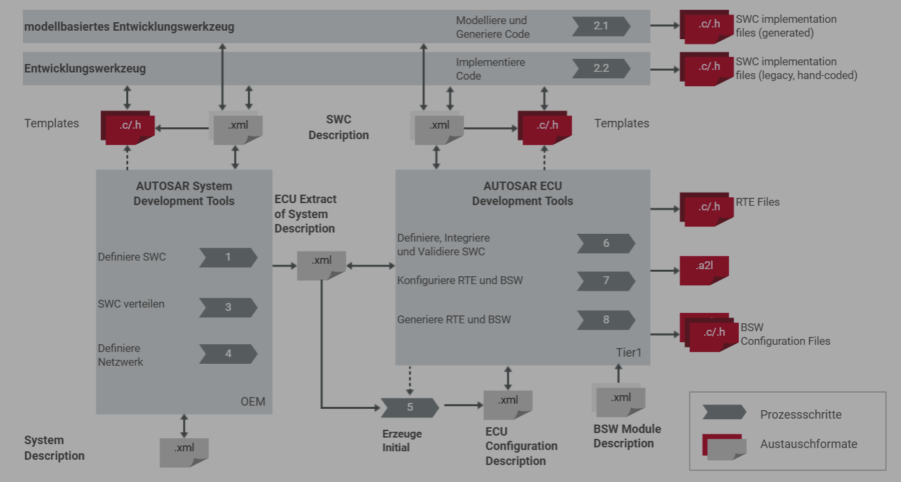

### Entwicklung der Funktionssoftware

Am Anfang wird die Funktionssoftware des Fahrzeugs als Gesamtsystem beschrieben. Das Gesamtsystem wird in Teilfunktionalitäten untergliedert, die als SWCs beschrieben werden. Diese SWCs übertragen Informationen (Datenelemente) unter Verwendung definierter Schnittstellen (Ports) an andere SWCs.

Konzeptionell wird dabei die gesamte Kommunikation zwischen den SWCs durch den VFB abgewickelt. Da zu diesem frühen Zeitpunkt noch nicht festgelegt ist, welche Softwarekomponente welchem Steuergerät zugeordnet ist, handelt es sich lediglich um eine logische Ansicht. Der VFB repräsentiert dabei die Kommunikation innerhalb eines Steuergerätes als auch zwischen den Steuergeräten. Die Anwendung hat keine Kenntnis über die darunter liegenden Technologien. Somit ist eine hardwareunabhängige Entwicklung und Nutzung der Anwendersoftware möglich.

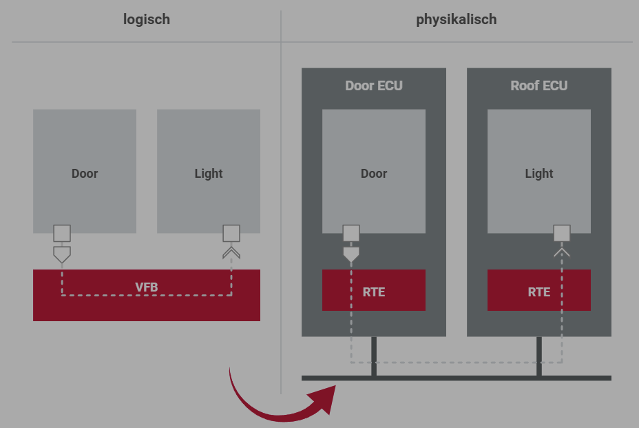

Nachdem alle SWCs und Schnittstellen festgelegt und definiert wurden, werden sie auf die entsprechenden Steuergeräte verteilt.

Eine steuergerätespezifische Laufzeitumgebung realisiert dann den Virtual Functional Bus. Die RTE organisiert die Kommunikation zwischen den einzelnen Softwarekomponenten und übernimmt – mit Hilfe des Betriebssystems – die Ausführung der Softwarekomponenten.

Runnable Entity ist die Ausführungseinheit einer Softwarekomponente, die letztlich als C Funktion implementiert wird. Wann ein Runnable Entity aufgerufen wird, wird durch den Entwickler konfiguriert und später durch die RTE realisiert. Dies könnte zum Beispiel zyklisch oder auch spontan beim Empfang eines Datenelementes sein.

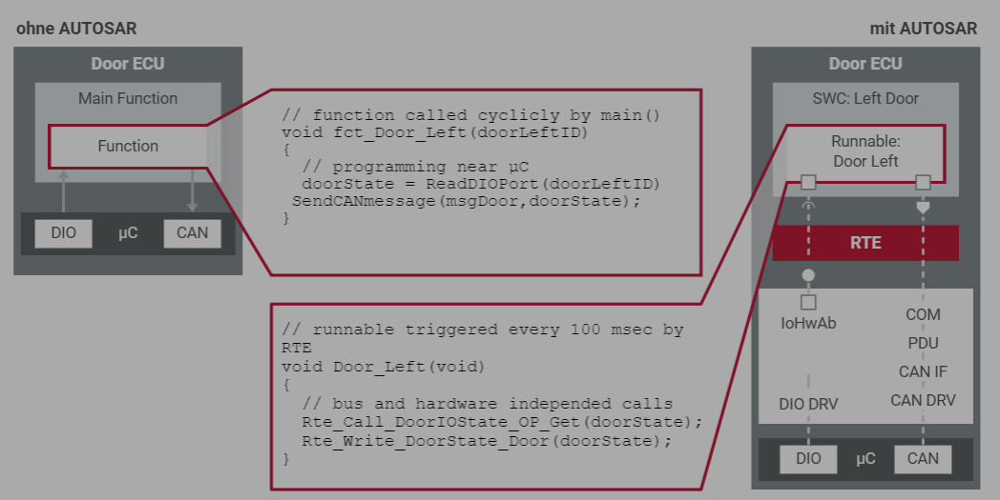

Als Kommunikationsschnittstelle sieht AUTOSAR Ports vor. Hierbei werden zwei Verfahren unterschieden:

Bei der Sender-Receiver (SR) Kommunikation werden Datenelemente von einer Softwarekomponente zu einer anderen übertragen. Diese Art der Kommunikation wird am häufigsten zwischen Applikationssoftwarekomponenten verwendet.
Syntaxbeispiel: Rte_Write_<Port_Name>_<Datenenelement_Name>(…)
Bei der Client-Server (CS) Kommunikation ruft der Client asynchron oder synchron eine Operation eines Servers auf. Dies ist vergleichbar mit einem Funktionsaufruf und kommt am häufigsten zwischen Applikation und Diensten (Services) der Basissoftware (Diagnose, Speicherverwaltung, …) vor.
Syntaxbeispiel: Rte_Call_<Port_Name>_<Operations_Name>(…)
Die SWC mit ihren Schnittstellen und Runnables wird in einer spezifisch erstellten SWC Description dokumentiert. AUTOSAR bietet allerdings keine Möglichkeit, das funktionale Verhalten zu beschreiben.

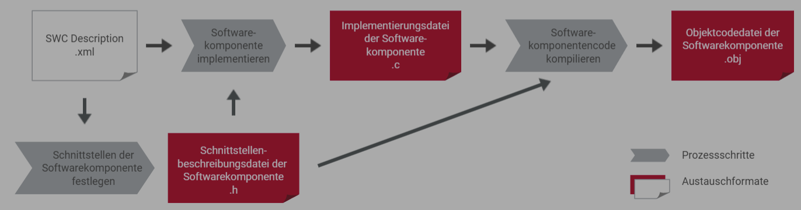

## Funktionssoftware in der Praxis

### AUTOSAR Arbeitsprodukte: Vom OEM zum Tier1

Basis für die Konfiguration eines AUTOSAR Steuergerätes ist der ECU Extract of System Description (ECUEX). Hierbei handelt es sich um eine XML-Datei (*.arxml) in einem von AUTOSAR definierten Schema. Sie enthält Vorgaben für die ECU Konfiguration und wird typischerweise vom OEM erzeugt.

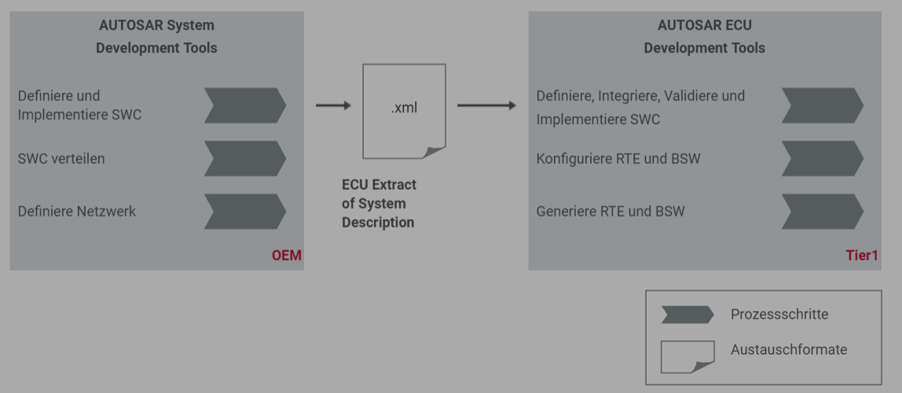

Bezüglich des genauen Inhaltes dieser Datei lässt AUTOSAR grundsätzlich einen Freiraum. Das bedeutet, dass bestimmte Inhalte dieser Datei optional sind. Der konkrete Inhalt hängt damit vom OEM ab. Folgende generelle Inhaltsvarianten sind denkbar:

Netzwerkbeschreibung (Anwendungsfall 1)
Netzwerkbeschreibung und Softwarekomponenten als Spezifikation (Anwendungsfall 2)
Netzwerkbeschreibung und implementierte Softwarekomponenten (Anwendungsfall 3)
Auf Basis des ECUEX muss der Tier1 die ECU Configuration Description (ECUC) erzeugen. Darin wird die detaillierte Konfiguration der Basissoftware gespeichert.

In der Übergangszeit werden sicherlich nicht alle Teilnehmer die reine AUTOSAR Methode leben. Deshalb ist es sehr gut vorstellbar, dass in dieser Zeit der Zulieferer von seinem OEM lediglich eine .dbc-, .ldf- oder FIBEX-Datenbasis bekommt und auf dieser Basis die ECUC erzeugen muss.

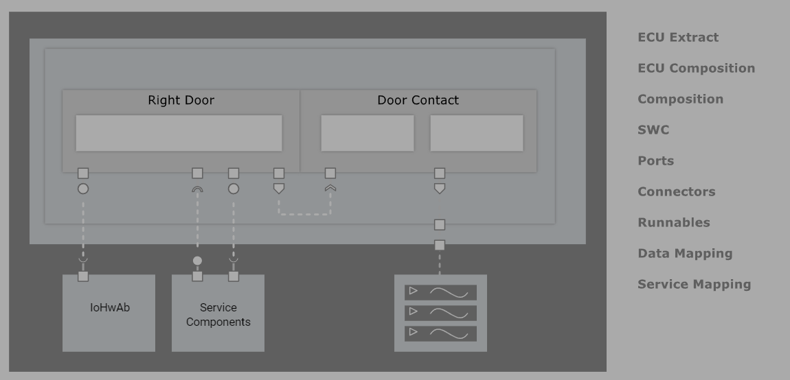

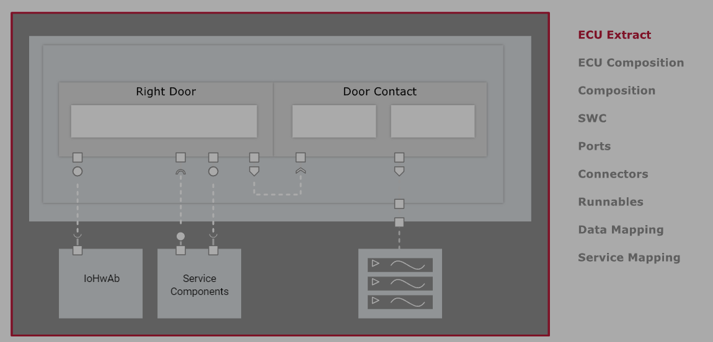

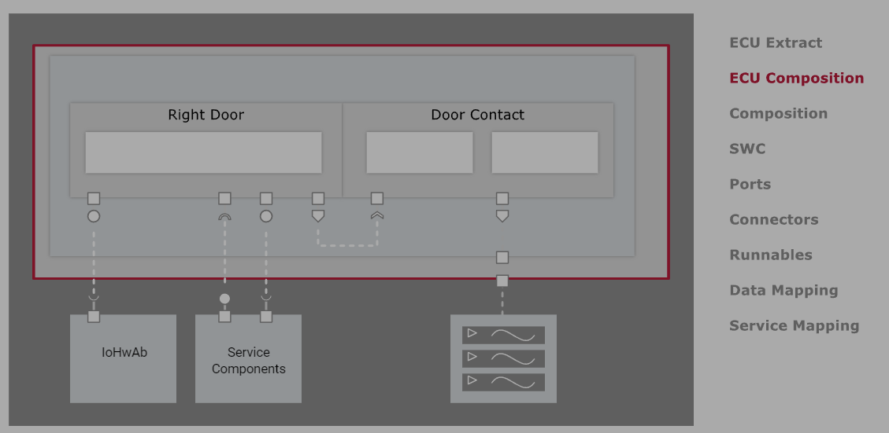

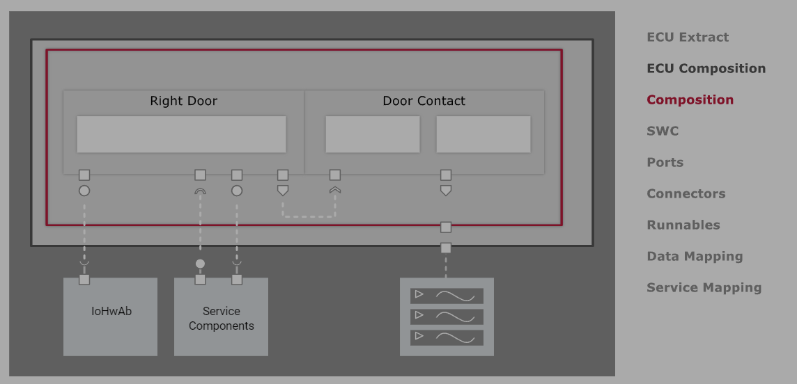

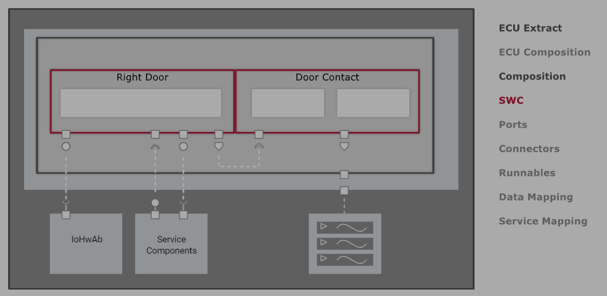

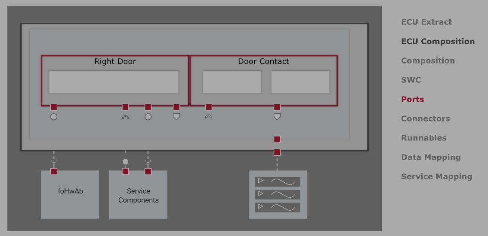

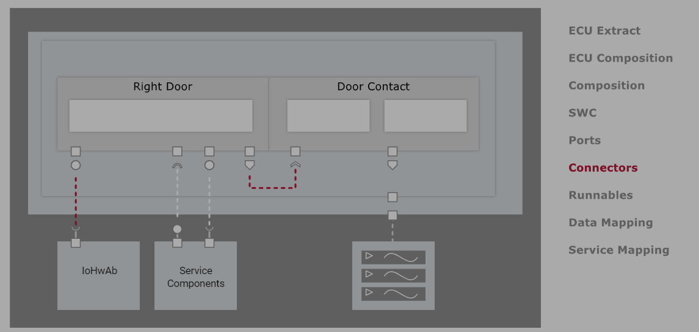

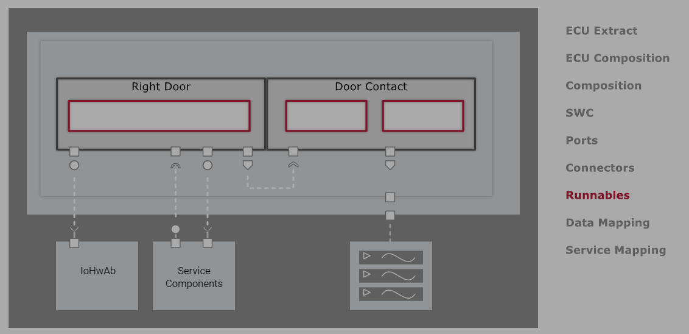

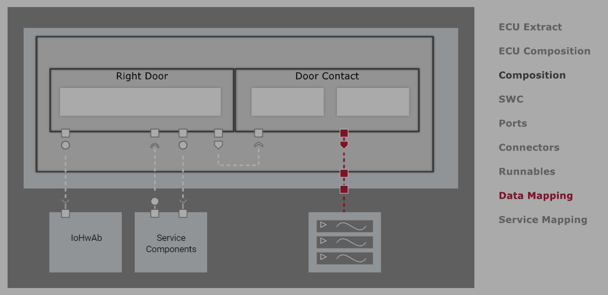

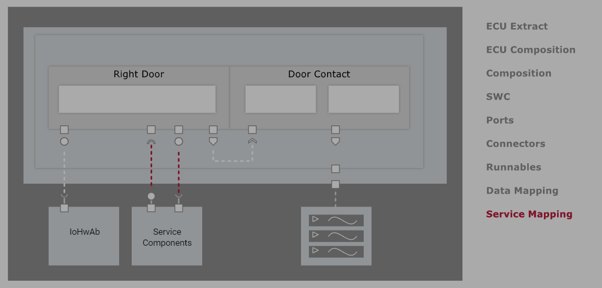

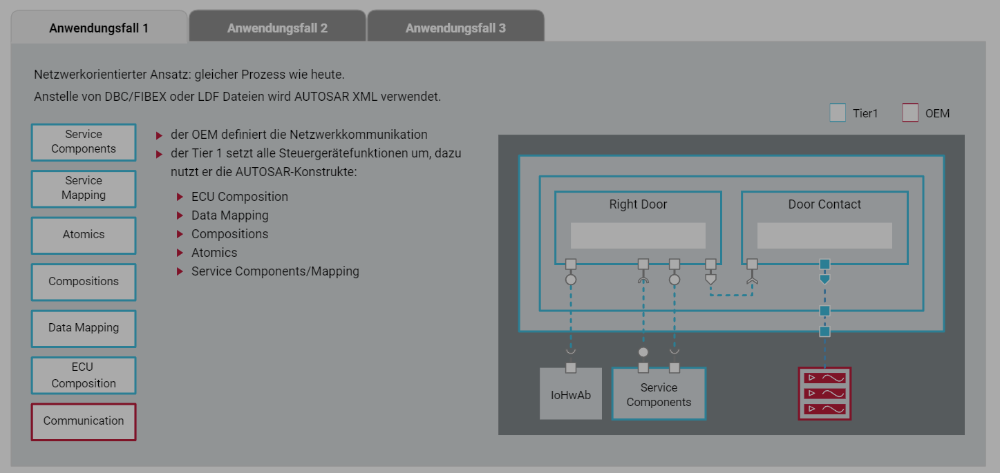

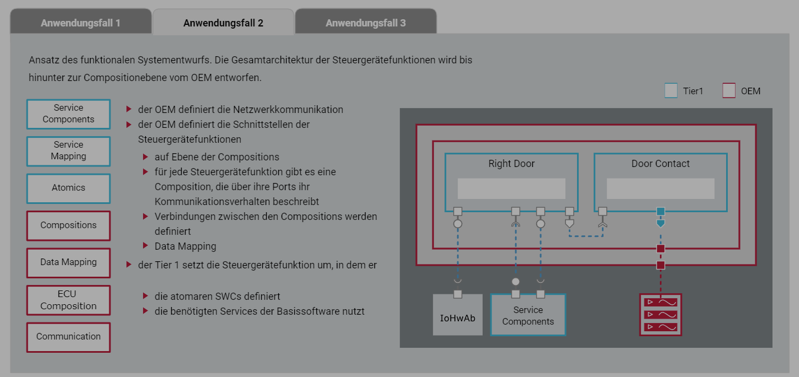

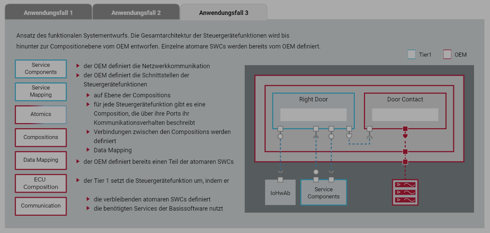

### Funktionssoftware

Softwarekomponenten
Die Funktionssoftware eines Steuergerätes ist in AUTOSAR über Softwarekomponenten realisiert. Das Kernprinzip besteht darin, eine formale Beschreibung der SWC zu erstellen (SWC Description), aus der sich die C-Schnittstellen der SWC ableiten. Die SWC Description wird in einer XML-Datei in einem von AUTOSAR definierten Schema abgelegt.

Passend zur SWC Description wird die Implementierung der SWC erstellt. Hierbei gibt es folgende Möglichkeiten:

Manuelle Entwicklung
Die Implementierung der SWC wird traditionell durch manuelle C-Codierung erstellt.
Modellbasierte Entwicklung
Zur Implementierung wird ein Verhaltensmodell der SWC erstellt. Basierend auf diesem Modell wird der C-Code automatisch generiert.

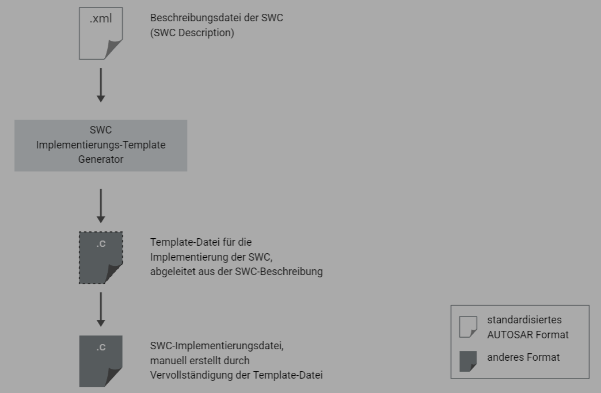

Hardwareunabhängigkeit
Das AUTOSAR Konzept der SWC zeichnet sich dadurch aus, dass die Implementierung der SWC ausschließlich vom Mikrocontroller unabhängige Schnittstellen hat. Damit sind die technischen Voraussetzungen gegeben, um die SWC auf unterschiedlichen Hardware-Plattformen betreiben zu können und damit eine bessere Wiederverwendung der SWC in verschiedenen Steuergeräten zu erreichen. Selbstverständlich gibt es Randbedingungen, die eine beliebige Inbetriebnahme einer SWC auf jedem beliebigen Steuergerät verhindern. So erscheint es heute nicht sinnvoll, eine Motorsteuerungsfunktion auf einem Türsteuergerät laufen zu lassen, selbst wenn dieses seitens der Schnittstellen möglich wäre.

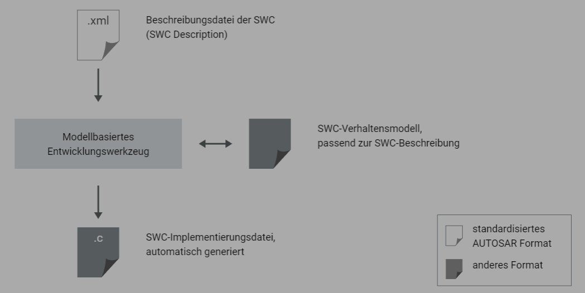

Wiederverwendung
Um eine Wiederverwendung in realen Entwicklungsprozessen zu ermöglichen, ist neben der Schnittstellenkompatibilität auch die Absicherung der SWC-Funktion an sich relevant. Dank der definierten Schnittstellen der SWC lassen sich nun auch Testkonzepte wie ein Unit-Test der SWC durchführen. Damit kann eine SWC unabhängig von anderen SWCs entwickelt werden und als in sich getestete Einheit in einer Bibliothek bereitgestellt werden. Dies kann sogar soweit führen, dass eine SWC als COTS erhältlich ist.

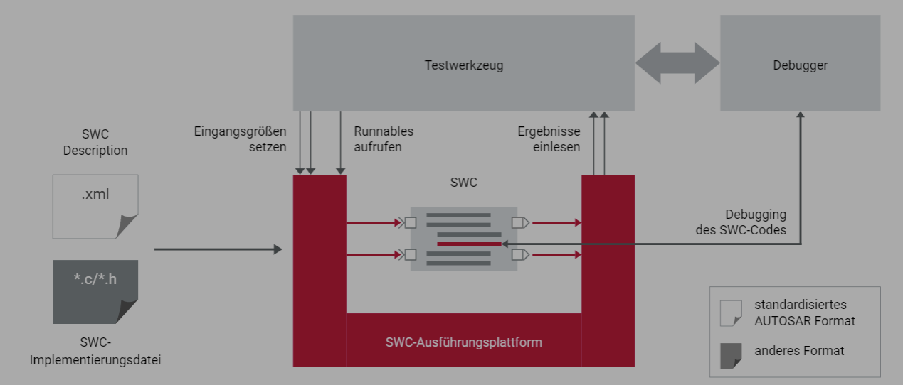

## Basissoftware und RTE

### Aufgabenbereich der Basissoftware

VFB
Ein System ist in Form von Softwarekomponenten beschrieben, welche über den VFB (bzw. steuergerätespezifische RTEs) untereinander verbunden sind. Diese abstrakte Beschreibung könnte suggerieren, dass AUTOSAR Basissoftware nur die Kommunikation abdeckt. Dies ist nicht der Fall.

steuergeräteinterne Dienste
Eine AUTOSAR Basissoftware bedient auch steuergeräteinterne Dienste wie Zustandsverwaltung (Steuergerätezustand und Steuerung der Kommunikationskanäle), Diagnosedienste, Watchdog-Dienste, Betriebssystem und die Verwaltung des nichtflüchtigen Speichers; selbst IO wird im Umfang der Standardisierung durch AUTOSAR behandelt.

MCAL
Speziell mit der Standardisierung des zuletzt genannten Themas (Ein- und Ausgabe) kommen die Halbleiterhersteller ins Spiel. Sie treten als Zulieferer der niedrigeren, hardwarenahen Softwareschicht (MCAL) auf. Durch die Standardisierung werden Themen, die vormals durch die Steuergerätelieferanten selbst gelöst wurden, auch zu einem neuen Geschäftsfeld der Lieferanten von Basissoftware.

In den Medienobjekten zur Software-Architektur wird die Vector Umsetzung des AUTOSAR Standards – MICROSAR – dargestellt.

### Eigenschaften der Basissoftware

Abstraktion
Die Abstraktion in Form von Softwarekomponenten ist nur möglich, indem die dazu nötigen Mechanismen auf Ebene der Basissoftware bereitgestellt werden.

Daher ergänzt die Basissoftware die RTE um diese Mechanismen. Besonders deutlich zeigt sich das beim Kommunikationsstack und dem Betriebssystem, die beide eng mit der RTE und deren Betrieb verwoben sind.

Aufgaben der Basissoftware
Die Basissoftware (BSW) muss beispielsweise Events erzeugen und Zeitgeber für die RTE bereitstellen. Über Kommunikationsbusse transportiert die BSW außerdem Daten über Steuergerätegrenzen hinweg. Beim Ausführen von nebenläufigen Runnable Entities innerhalb der Softwarekomponenten, gehören sowohl die Ablaufsteuerung als auch das Verwalten von Systemzuständen zu den Aufgaben der Basissoftware. Des Weiteren stellt sie Synchronisationsprimitive zur Verfügung, um nebenläufige Zugriffe zu serialisieren.

### Die RTE und deren optimale Konfiguration

Um die in der Beschreibung der Softwarekomponenten enthaltenen Kommunikations- und Aufrufmechanismen realisieren zu können, wird eine effiziente Laufzeitumgebung (RTE) benötigt.

Erzeugung der RTE
Dank der formalen Beschreibung der SWCs eröffnet sich die Möglichkeit, das Software Design automatisch zu analysieren, daraus eine optimierte Laufzeitumgebung abzuleiten und zu generieren. In dieser formalisierten Beschreibung eines Softwaredesigns ist beispielsweise enthalten, in welchem Kontext ein Runnable Entity aufgerufen wird, und ebenfalls wie es mit anderen Teilen derselben oder einer anderen SWC in Interaktion tritt.

Wenn man weitere Randbedingungen wie die Konfiguration der Basissoftware betrachtet, kann man Entscheidungen treffen, wie ein Funktionsaufruf optimal implementiert werden kann.

Festlegungen
Es müssen grundsätzlich Entscheidungen getroffen werden über

die Verwendung und die Auswahl des Sperrmechanismus gegen den nebenläufigen Zugriff aus anderen Runnable Entities.
die Methode des Aufrufs.
Er erfolgt entweder direkt (als Makro oder C-Funktionsaufruf) oder mittelbar durch ein RTE Event, das mit Hilfe des Betriebssystems ausgelöst wird.
die Art und Weise eines Schreib- oder Lesezugriffs.
Dies kann entweder der Zugriff auf eine Variable sein, oder auch der Aufruf einer API der Basissoftware. Die Semantik verschiedener Zugriffsarten ist hier ebenso zu berücksichtigen wie die Mechanismen, mit denen sie umgesetzt sind.
Je nach Konfiguration kann diese Auswahl mehr oder weniger günstig getroffen werden.

Optimierungen
Im Allgemeinen sollte der Generator der Laufzeitumgebung für einen sparsamen Einsatz von OS Events und Alarmen sorgen. Durch eine geschickte Konfiguration des Systems können jedoch zusätzliche, wesentlich größere Einsparungen beim Ressourcenverbrauch und der Laufzeit erzielt werden. Dazu ist es nötig, die Auswirkungen bestimmter Entwurfsentscheidungen während der Designphase der Softwarekomponenten zu kennen.

### OEM-Abhängigkeiten in der Basissoftware

Modularität
Ein Kennzeichen der AUTOSAR Basissoftware ist der hohe Grad der Modularisierung. Diese Modularisierung erfolgt horizontal in unterschiedlichen Aufgabengebieten (clusters) und vertikal in unterschiedlichen Abstraktionsebenen oder Schichten (layers). AUTOSAR erlaubt eine unterschiedliche Granularität der Basissoftware (Implementation Conformance Classes, ICC). Dies ermöglicht die Zusammenfassung (clustering) von BSW-Modulen bis hin zur monolithischen Basissoftware, bestehend aus nur einem Modul, das die Basissoftware funktional abdeckt.

AUTOSAR Basissoftware ist nicht notwendigerweise OEM-spezifisch, jedoch gibt es einige Punkte, in denen sich die BSW Stacks der OEMs typischerweise unterscheiden.

OEM spezifische Stacks
Beispielsweise unterscheiden sich die Stacks in der Anzahl und dem Aufgabenbereich bestimmter BSW-Module, die nicht Teil des AUTOSAR Standards sind. Es gibt aber auch funktionale Erweiterungen der AUTOSAR Basissoftware in Form von Softwarekomponenten, die dem Stack hinzugefügt werden.

In der Struktur der Basissoftware treten solche Variationen auf folgenden Gebieten auf:

DIAG: Diagnostic Event Manager, Diagnostic Communication Manager
SYS: Communication Channel Handling
COM: Network Management
COM: Gateway Funktionalität
spezifische Dienste wie Verschlüsselungsmodule, proprietäre Transportprotokolle, etc.
OEM spezifische Prozesse
Was die Konfiguration der Basissoftware betrifft, gibt es bei verschiedenen OEMs auch Unterschiede in den Arbeitsabläufen:

in der Art und Weise wie OEM-Vorgaben eingespeist werden (.dbc-Datei, ECU Extract of System Description oder separate SWC Beschreibungen)
Ausgestaltung und Bedatung der Diagnose (ODX, CANdela-Datei, …)
generelle Anforderungen wie z.B. Fähigkeit zur Post-Build-Konfiguration des Kommunikationsstacks, Library-Lieferungen an die Lieferanten
Im Medienobjekt zur Software-Architektur wird die Vector Umsetzung des AUTOSAR Standards – MICROSAR – dargestellt.

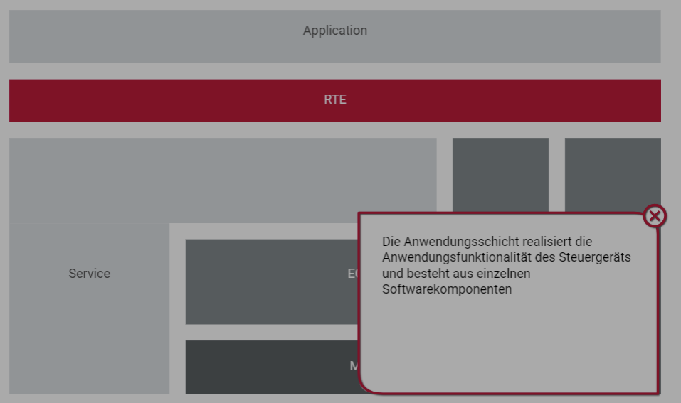

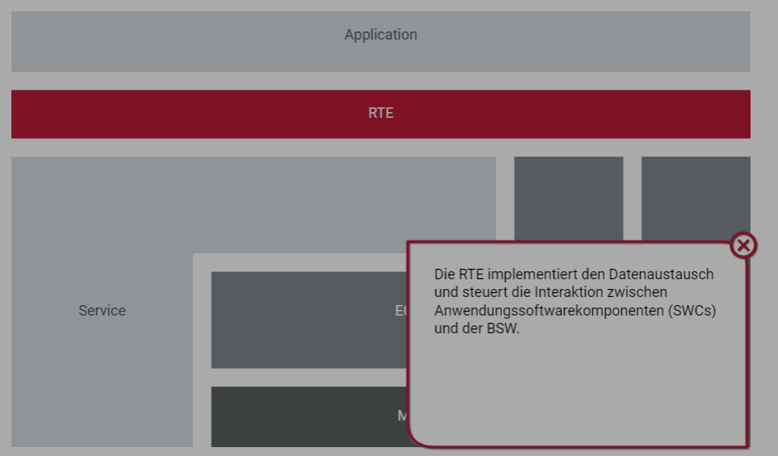

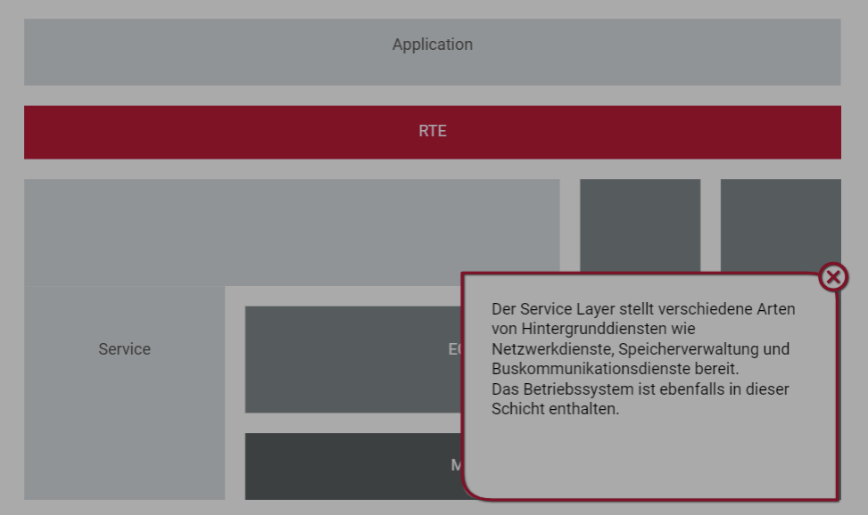

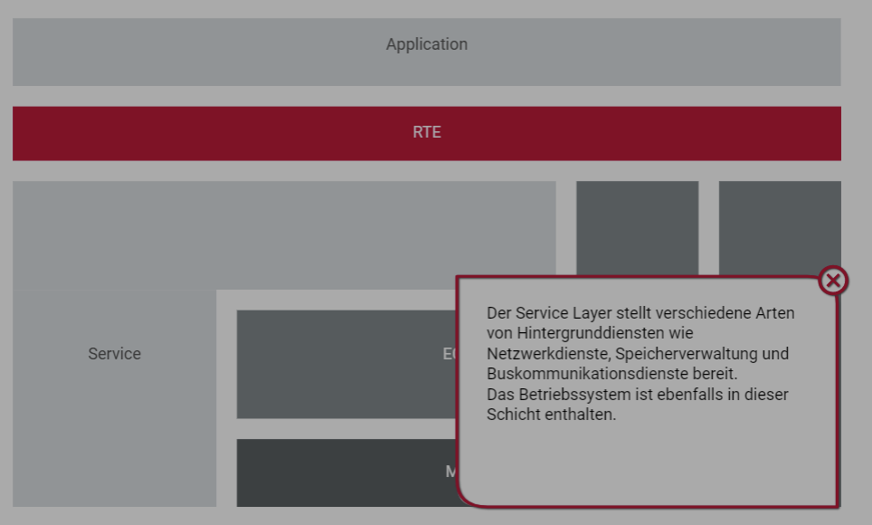

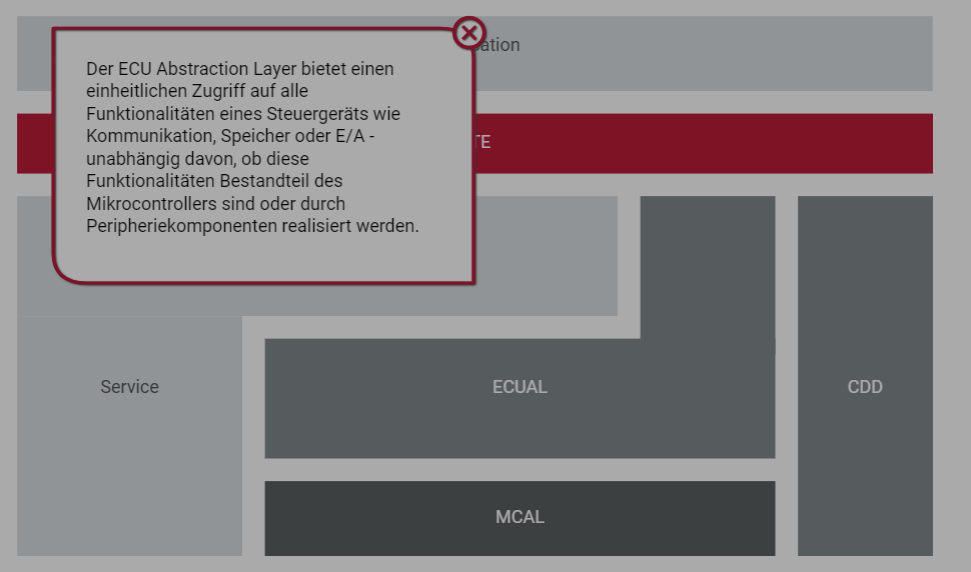

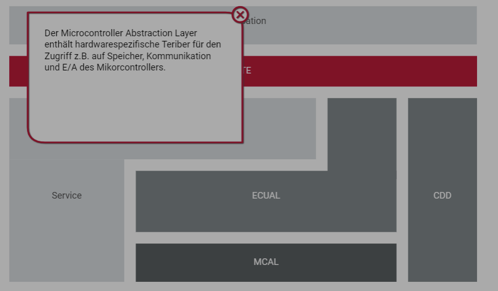

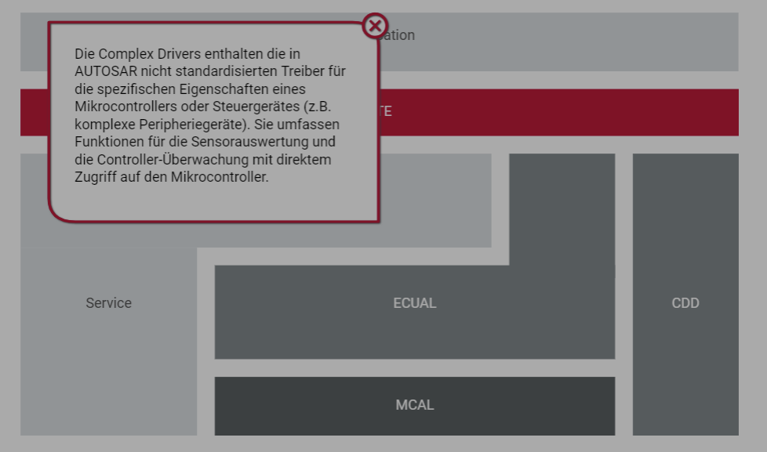

### Woher kommt die Basissoftware

Bei unterschiedlichen OEMs variiert die Art und Weise, wie die Zulieferer mit der Basissoftware umgehen müssen.

Fokus detaillierte Vorgaben
So gibt es Modelle, bei denen der OEM die hardwareunabhängigen Teile der Basissoftware bei einem bestimmten Softwarehersteller bereits lizensiert hat. Der Zulieferer muss dann nur noch die hardwareabhängigen Teile beziehen. Teilweise stellt der OEM dem Zulieferer für eine Auswahl an Zielplattformen auch komplett vorintegrierte Basissoftwarepakete kostenfrei zur Verfügung.

Fokus funktionale Vorgaben
Es gibt auch noch andere Modelle, bei denen der OEM nur die Funktionalität der Basissoftwaremodule vorgibt, die technische Umsetzung und Integration aber vollständig dem Zulieferer des Steuergerätes überlässt. Dieser kann dann die Module bei einzelnen Softwareherstellern beziehen. Die eingekauften Module kann der Zulieferer dann selbst zu einem Basissoftwarepaket integrieren, oder dies bereits durch einen Softwarehersteller erledigen lassen.

Eigenentwicklungen der Zulieferer
Einige große Zulieferer besitzen Eigenentwicklungen der AUTOSAR Basissoftware und treten daher auch als Softwarehersteller dieser Eigenentwicklungen auf. Je nach Zusammenarbeit mit dem OEM gibt es bestimmte Absprachen über die Verwendung dieser Software.

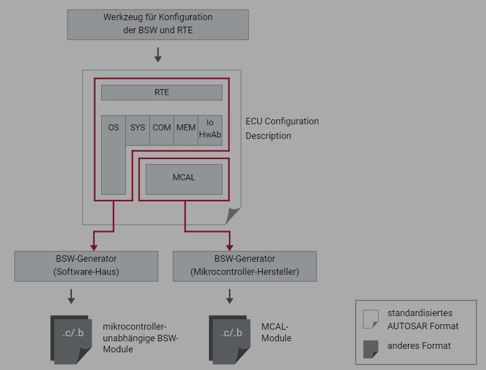

## Werkzeuge, Umstieg und Test

### Werkzeuge

Während der Entstehung eines AUTOSAR Steuergerätes kommen verschiedene Werkzeuge zum Einsatz. Die Aufgaben dieser Werkzeuge lassen sich grob nach folgenden Typen unterscheiden:

Werkzeuge für Systementwurf
Diese Werkzeuge dienen zur Definition der Netzwerkarchitektur und -kommunikation sowie Entwurf und Verteilung der SWCs.
Werkzeuge für die Konfiguration der Basissoftware und der RTE
Diese Werkzeuge kommen zum Einsatz, um eine Konfigurationsbeschreibung der BSW-Module des Steuergerätes zu erstellen (ECU Configuration Description).
Code-Generatoren für BSW-Module
Auf Basis der ECU Configuration Description erzeugen Code-Generatoren spezifisch angepasste BSW-Module für das Steuergerät.
Austauschformat
Diese Aufgaben werden typischerweise von unterschiedlichen Werkzeugen wahrgenommen. Ein wichtiger Bestandteil von AUTOSAR ist daher ein standardisiertes XML-Format, auf dessen Basis Entwurfs- und Konfigurationsdaten zwischen verschiedenen Werkzeugen ausgetauscht werden können.

Diese Standardisierung ist essentiell, da typischerweise Werkzeuge unterschiedlicher Hersteller im gleichen Entwicklungsprojekt zum Einsatz kommen. So kann zum Beispiel die mikrocontroller-unabhängige BSW von einem Softwarehaus kommen, während der MCAL samt passenden Code-Generatoren vom Halbleiter-Hersteller bereitgestellt wird.

Potentiell könnte sogar für jedes BSW-Modul ein separates Werkzeug eingesetzt werden. Aus praktischer Sicht ist es allerdings empfehlenswert, die Konfiguration der BSW über ein einheitliches Werkzeug durchzuführen.

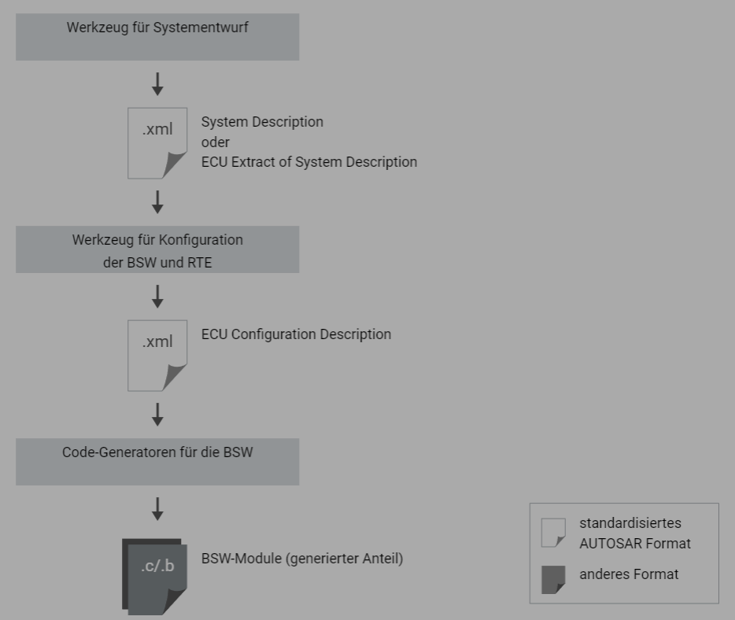

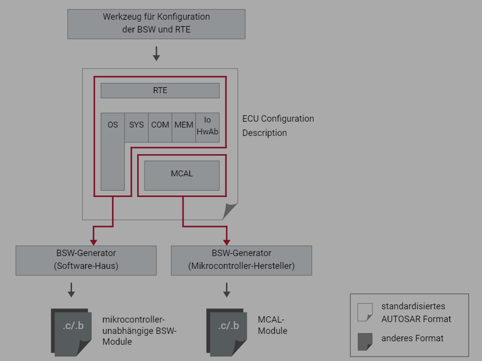

### Migrationslösungen

legacy Software
AUTOSAR sieht bereits im Standard vor, dass auch Steuergerätesoftware in die AUTOSAR Welt übertragen werden kann, die nicht nach der AUTOSAR Methode entwickelt wurde. Dazu definiert man gemäß AUTOSAR einen spezifischen Complex Driver.

Ein Complex Driver kann als eine spezielle Art von SWC betrachtet werden, die nicht zwingend eine nach dem SWC Template formalisierte Beschreibung haben muss.

Complex Driver
Ein komplexer Gerätetreiber darf ohne die RTE zu benutzen auf die AUTOSAR Basissoftware direkt zugreifen. So wird aus Sicht der Anwendung „nur“ die Basissoftware ausgetauscht, während die Applikation weitgehend bleiben kann wie sie ist. Die Applikation kann also im Rahmen der Migration als komplexer Gerätetreiber aufgefasst werden. Dies kann als erster Schritt in Richtung einer AUTOSAR Software-Architektur verstanden werden. Dieser erste Schritt ist vom Entwicklungsaufwand gesehen die kostengünstigste Variante.

direkte Vorteile
Bereits hier kann man jedoch schon von Teilen der AUTOSAR Funktionalität profitieren, indem man z.B. zyklische Anteile der Applikation durch die RTE aufrufen lässt oder Kommunikation und Diagnose über die RTE laufen lässt während der Applikationskern noch nicht AUTOSAR konform umgesetzt ist.

weitere Schritte
Langfristig eliminiert man die nicht nach AUTOSAR modellierten Teile der Applikation, insbesondere alle Task-Körper und Aufrufe ins Betriebssystem sowie alle Stellen mit Interruptsperre und andere Basissoftwarezugriffe. Diese werden durch AUTOSAR konforme Elemente ersetzt. Auf diese Weise sind die Applikationsteile bei einem guten Design dann effizienter umgesetzt als früher.

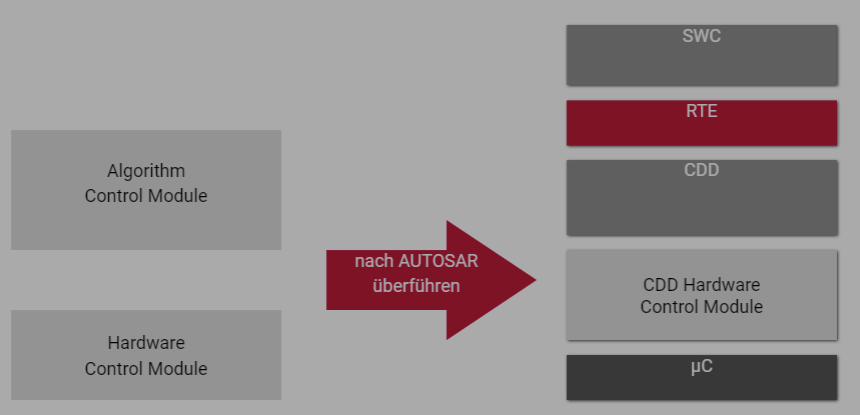

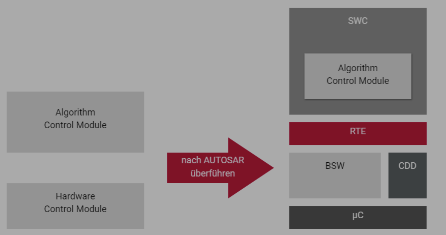

### Test von AUTOSAR Steuergeräten

Blackbox- Tests
Beim Testen eines AUTOSAR Steuergerätes lassen sich grundsätzlich die gleichen Verfahren anwenden wie beim Test von Steuergeräten mit einer anderen internen Software-Architektur. Betrachtet man das Steuergerät als Blackbox, gibt es lediglich folgende Dinge zu beachten

Netzwerk Management:
AUTOSAR hat ein eigenes Netzwerk Management (NM) Protokoll definiert, das sich von den bisher eingesetzten Protokollen wie z.B. OSEK NM unterscheidet. Die Testumgebung muss dieses NM-Protokoll berücksichtigen und die entsprechenden Botschaften auf den Netzwerk-Kanälen korrekt bereitstellen bzw. verarbeiten.
Dateiformate für die Beschreibung der Netzwerk Kommunikation:
Die Beschreibung der Netzwerk Kommunikation in AUTOSAR ist Bestandteil der System Description. Je nach Vorgabe des OEMs werden die bisherigen Formate wie .dbc, FIBEX oder .ldf durch das neue Format ersetzt. Die Testumgebung muss in der Lage sein, dieses Format zu verarbeiten.
nutzbare Zustandsgrößen
AUTOSAR bietet allerdings auch einen Zusatznutzen beim Testen und Debuggen des Steuergerätes: durch die standardisierte interne Software-Architektur existieren in jedem AUTOSAR Steuergerät bestimmte Zustandsgrößen, die in der Testumgebung berücksichtigt werden können. Beispiele hierfür sind der Steuergerätezustand, der im EcuM-Modul vorliegt, oder Kommunikationszustände der einzelnen Netzwerkkanäle, die im ComM-Modul hinterlegt sind. Bei geeigneter Implementierung der BSW-Module kann ein Zugriff auf diese Zustandsgrößen über einen XCP-Zugang zum Steuergerät stattfinden, z.B. über eines der Netzwerke oder eine Debugging-Schnittstelle wie JTAG oder Nexus. Eine passende Beschreibungsdatei (A2L) für diese Zustandsgrößen kann von den BSW-Generatoren bereitgestellt werden. Alternativ lässt sich für den Zugriff auch das speziell für diesen Zweck von AUTOSAR definierte Monitoring- und Debugging-Protokoll verwenden.

Zugriff auf SWC- Kommunikation
Auch beim Zugriff auf die Applikationsebene bietet AUTOSAR Vorteile. So kann die RTE derart generiert werden, dass ein Zugriff auf die zwischen den SWCs ausgetauschten Daten möglich ist. Auch hierfür kann wieder eine passende A2L-Datei vom RTE-Generator erzeugt werden.

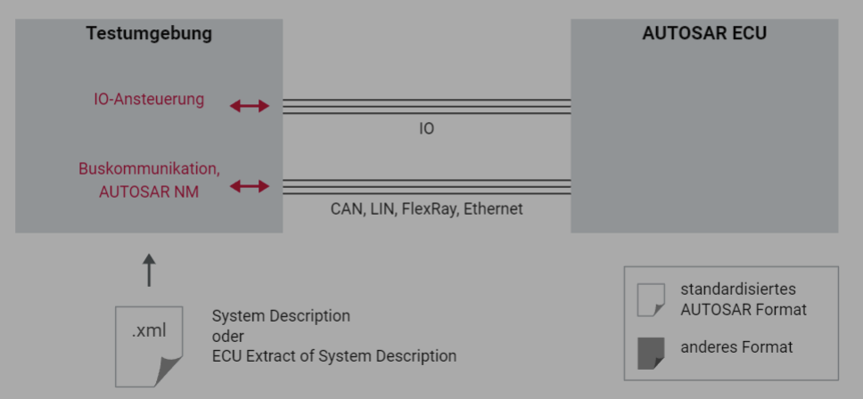

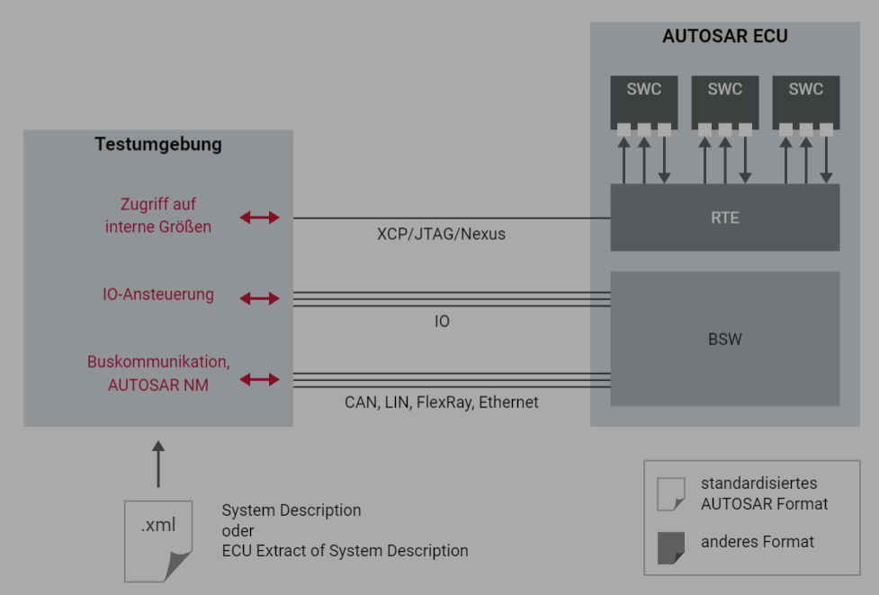
